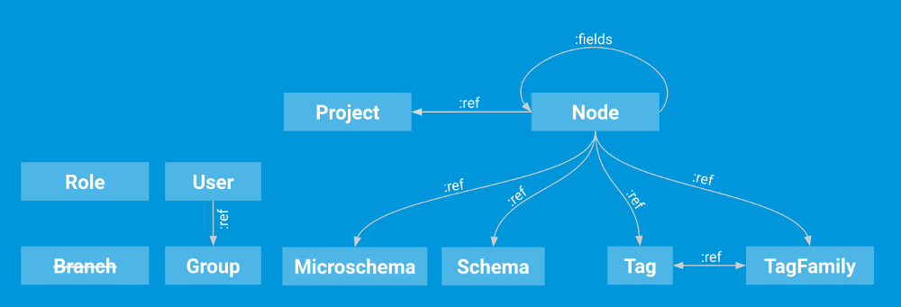
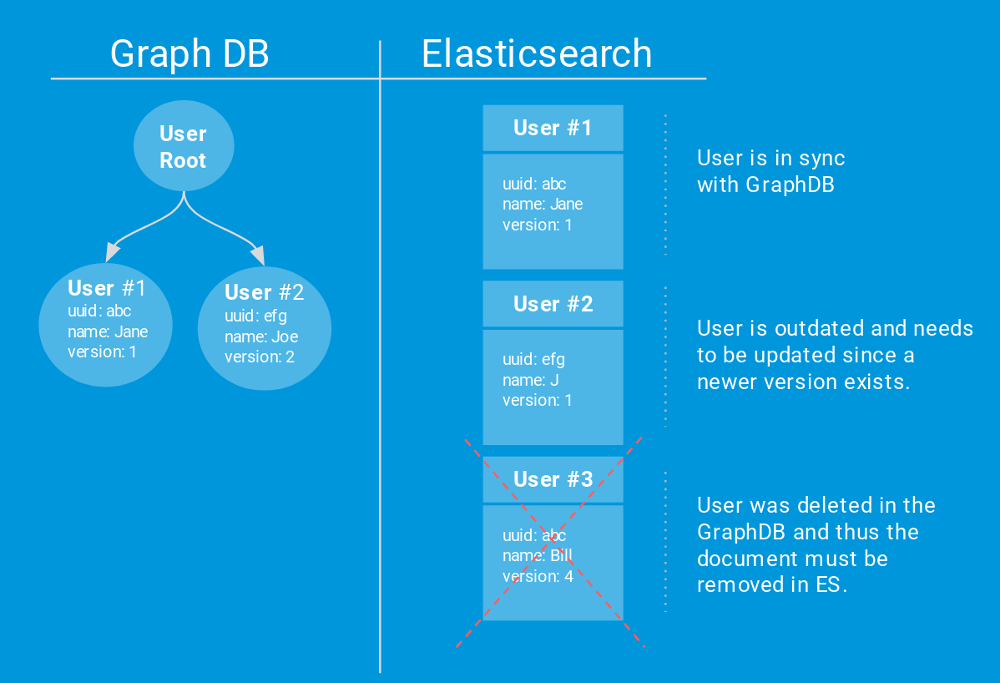
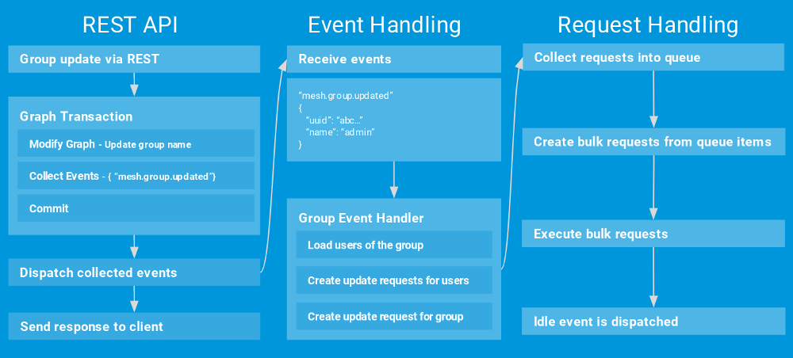

:icons: font
:source-highlighter: prettify
:toc:

=== What needs to be synced?

In Gentics Mesh we store various elements within a graph database like users, roles, groups, content elements, tags. The graph database is great for storing and loading deeply nested data structures (e.g. tree structures, references between contents, linkages). Searching in text and large datasets however can be best achieved by using a dedicated search index. In the case for Gentics Mesh we choose to integrate Elasticsearch to meet this requirement. 

Before we can sync anything we need to determine what should be synced and how the synced data should be structured.

This is determined by multiple factors. First we need to decide what fields of the document/element should be searchable. Secondly we need to take the update cost into account.

What do I mean by update cost? Lets say we store a document that represents a group element. The group has a _name_, _uuid_ and a list of _roles_.

[source,json]
----
{
    "uuid" : "df81c23d9ff1450081c23d9ff195005e",
    "name" : "Client Group",
    "roles" : [ {
      "name" : "Client Role",
      "uuid" : "ddcddceb33d648318ddceb33d618314f"
    }, {
      "name" : "admin",
      "uuid" : "cc9999a4194d4f069999a4194d1f06d7"
    } ]
}
----

Storing this document would just work fine but what needs to be done once any of the listed client roles gets renamed? In those cases all groups which list the updated role would need to be updated in the index as well. We can reduce the need for these referential updates by only including immutable fields (e.g. the role uuid). This way the update cost is reduced.

In our case we did not need to store this relationship in the search documents. Thus we don't need to update the group once a new role has been assigned or unassigned. User documents on the other hand contain a array of groups they belong to. Updating the group name will thus require all users of those groups to be updated as well.

[source,json]
----
{
  "uuid" : "589319933be24ec79319933be24ec7fe",
  "username" : "joe1",
  "emailaddress" : "joe1@nowhere.tld",
  "firstname" : "Joe",
  "lastname" : "Doe",
  "groups" : {
    "name" : [ "editors", "superEditors" ],
    "uuid" : [ "df81c23d9ff1450081c23d9ff195005e", "df81c23d9ff1450081c23d9ff195005e" ]
  }
}
----

For us it was very helpful to keep track of these references in a easy to follow chart:

// https://docs.google.com/drawings/d/1C0FAd3RjYAlU58DNuZd2ghA9p4pGYJBkggNmCYl8X1Y/edit

== Tasks

The Elasticsearch integration in Gentics Mesh has to achieve multiple tasks.

=== Document transformation

Gentics Mesh elements need to be transformed to documents which can be stored in the search index.

=== Index creation

The integration needs to keep track of needed indices and create those if needed.

TIP: Prefix your indices so that multiple instances of your application can use the same Elasticsearch cluster.

TIP: Use link:https://www.elastic.co/guide/en/elasticsearch/reference/current/indices-templates.html[Index Templates] to manage custom mappings and index settings.

=== Document synchronization

Since both systems (Gentics Mesh and Elasticsearch) can run completely independent from each other it is required to add a mechanism which synchronizes the data. Each document that is stored in Elasticsearch contains a _uuid_ and also a _version_. Documents which need to be updated can be found by comparing the version field in the search index with the _version_ that is also stored in Gentics Mesh. Documents which can only be found in ES will be removed since they have no counterpart in Gentics Mesh. Missing documents will be added.

// https://docs.google.com/drawings/d/1aoK07oxwvIaft4oEeFzFh_2KLWAcI9fNHrhkiNlOhuw/edit

=== Handle document updates

CRUD operation on Gentics Mesh REST API can update elements. These updates need to be propagated to Elasticsearch. This process also needs to take the previously mentioned references between elements into account.

=== Permission updates

The uuid of roles which grant read permission for a specific element will also be stored in ES along with the fields of the element.
The permission update process will however make use of partial document updates to update the changed information once permissions are changed.

=== Process content migrations

Migrations of contents can introduce new fields or change the type of fields in the documents. During this process a new index is created and documents are added to this index. Already migrated documents are removed from the old index. This way search operation is not interrupted since both indices are used while the migration process is running.

=== Wrapping searches

It would be possible to run search request against ES without the involvement of Gentics Mesh. Using Gentics Mesh in the middle as a proxy for the search request allows us to apply permissions checks to the search query and also to select the desired indices that need to be searched.

== Tips

The integration of Elasticsearch has been updated in various ways. I want to give short summary of things we tried and what worked good for us and what did not.

=== Don't persist pending operations

One of the first integrations of the Elasticsearch integration persisted all needed update operations in the graph database. This log or batch as we called it was processed at one point and completed tasks were removed. We quickly stepped back from this process since it cause a high IO burden on the graph database.

=== Keep pending operations in memory

Next we decided to keep the operation log in memory and process it once the CRUD operation was committed.

=== Use batches instead of single requests

Using batch operations on Elasticsearch has drastically increased write performance. The batch size should however fit to the elasticsearch operation queue size. Otherwise you will perhaps have to deal with HTTP 429.

=== Handle HTTP 429

Any system can fail or overload. When building your own sync mechanism you should deal with HTTP 429 (Too Many Request) errors. If the operation queue size of ES is full it will throw this error and the syncing process must wait. 

TIP: It is a good idea to implement back pressure to propagate this state back to the sync process to reduce the amount of newly generated requests.

TIP: Add a linear or exponential back off time to your requests to gradually reduce the burden on the Elasticsearch instance.

=== Event based 

With Gentics Mesh _0.32.0_ we updated the Elasticsearch synchronization process. Before, the sync operation was executed directly after the element has been updated. Now this process has been decoupled. The initial update operation will invoke _Events_ which will be picked up by the Elasticsearch integration.

Updating a group will cause the `mesh.group.updated` event to be dispatched. This event will be picked up by our Elasticsearch Event Handler. This handler will create the needed elasticsearch update requests.
These update requests will be collected in a central queue. Another process will pick items from this queue and create bulk requests. Every two seconds after the last request is received a bulk request is created. Bulk requests are also created when the queue size exceeds the configured limit.

Failed requests will automatically be retried.

Finally an idle event will be dispatched after a certain time of inactivity.

// https://docs.google.com/drawings/d/1jBfAmIgCDw-rgEE5R8qDvr149cGgYUIyB-agNX3FjAU/edit

=== Resilience

Failed batch requests will automatically be retried. If too many issues occur Gentics Mesh will automatically invoke an index sync in order to recover from the issue. This sync will be retried until Elasticsearch becomes responsive again.

=== Track documents

As mentioned above it is required for the shown sync process to keep a common element id between your source and Elasticsearch. Adding a _version_ id will also help you track changes between both data sets.

Image via link:https://unsplash.com/[Unsplash] by link:https://unsplash.com/@marcusdallcol[Marcus Dall Col]