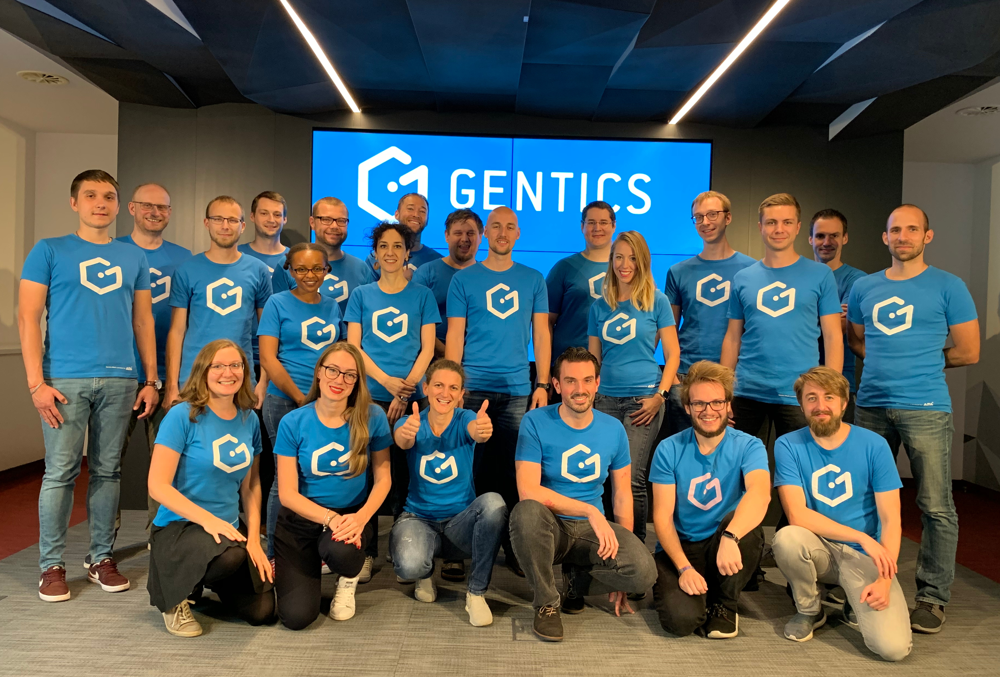
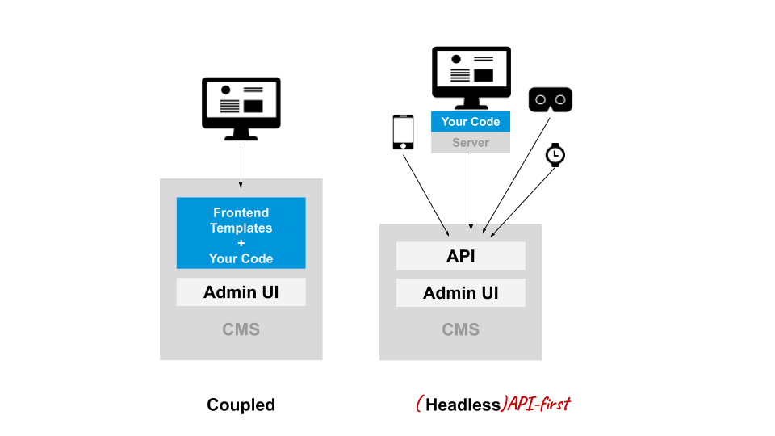
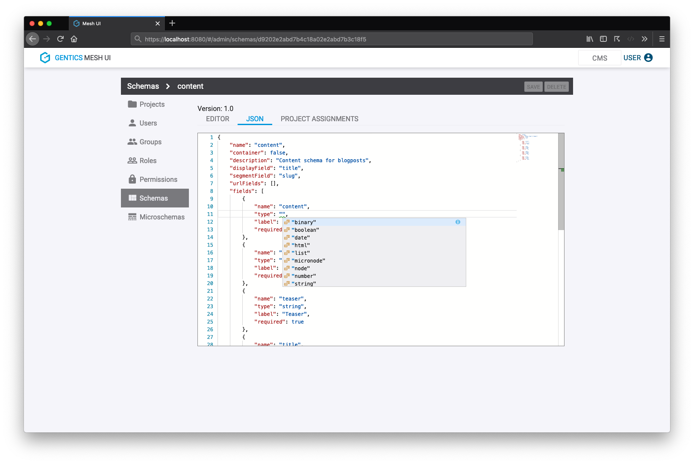

:icons: font
:figure-caption!:
:toc:

*We are very excited to announce the release 1.0 of Gentics Mesh.*

If you haven't heard about it yet, Gentics Mesh is your friendly, enterprise-grade, open-source headless CMS.
To be honest, it's more than that: it's your application development platform to develop your websites, your IoT applications, your mobile apps, your smart devices and your digital signage solutions.
With its best-in-class APIs, a complete feature list and great documentation, you'll get your projects done successfully in less time, no matter which technology you prefer.

Today, after an extensive beta phase, we are ready to launch version 1.0.

.The team behind Gentics Mesh (this time not drinking champagne)

== What is a Headless CMS?

Traditional CMSes are "coupled", which means that the CMS also takes care of the presentation layer responsible for delivering the content to the clients.
The content and the presentation are closely interlinked. Typically, content managers create and manage their content through tools like WYSIWYG editors.
The CMS then delivers the content according to the front-end delivery layer built into the CMS. Typically, a traditional CMS supports your websites but not much else.

A pure headless CMS is different, because it offers no front-end capabilities at all, giving you full control of your customer experience via APIs.
The CMS typically provides content managers with a presentation and channel agnostic way of managing content.
It requires a front-end development team to manage the rest with the frameworks and tools they prefer:
The content can be loaded by external applications which handle the content delivery to the client, meaning that the content can be (re-)used by multiple applications and channels (web, mobile app, audio guides, IOT).

.A coupled vs a headless CMS

== Why pick Gentics Mesh?

Gentics Mesh is the platform that holds your content, gives you great APIs to access and modify it, while relieving you from handling permissions, multi-language aspects, search, and much more.
You can use its modern user interface that makes content editing and administration enjoyable.
At the same time, we don't lock you in: You choose the technology and programming language you want to implement your application with.
You decide whether you want to host it locally or in the cloud.
We don't care if you're a Windows, Linux or Mac guy or girl.
Also, with its Apache license, you are free to use it, modify it and improve it.

What makes Gentics Mesh special over other headless CMSes is:

* its built-in user management not only covers the admin and editor features, but can also be used for handling access to your application.
* it thinks in content trees (just like websites do), which brings you many things for free: automatic navigation menus, automatic beautiful URLs, built-in link resolving, ...
* it is scalable and built for clustering, so your deployment can grow with your project's success.

== Awesome Projects built with Gentics Mesh

We are proud of the growing Gentics Mesh community and the many websites around the world that are already powered by Gentics Mesh.
Amongst them are two companies which successfully launched impressive Gentics Mesh projects just recently:

* The french retail group Auchan is continuously replacing three SAP-based e-commerce solutions with a new website powered by Gentics Mesh.
We have link:[talked to Clément Schockaert, window=_blank], software architect at Auchan Retail France, about their experience with running such a high-volume, dynamically scaling website.
* Over and above, the Austrian wholesales group Eurogast has finished migrating their Magento-based webshops to a new tailor-made solution leveraging Gentics Mesh's multi-website capability.
In our link:[discussion with Karl Regensburger and Johannes Geiger, window=_blank], both IT project managers of Eurogast, we also learned about their impressive timeline when going to production.

Aside from these examples, many link:https://www.gentics.com/genticscms/references.en.html[customers of our commercial Gentics Content Management Platform, window=_blank] are using Gentics Mesh.

If reading our Auchan and  Eurogast success story inspired you to wanting to get your hands dirty, I recommend checking out our Musetech demo, which highlights how easy a complete website for a (hypothetical) museum can be implemented with Gentics Mesh.
The code is open source, so you can fiddle around with it and use it for your own museum 🤓.
Start by reading the link:[Musetech demo blog post, window=_blank].
If you're rather looking for a static site generator example, our link:[Gentics Mesh + Hugo guide, window=_blank] will get you running in no time.

== What is new in 1.0?

If you're already familiar with Gentics Mesh, this is what we changed for 1.0:

We rewrote our *user interface* in *Angular 7* to reuse our open source component library link:https://gentics.github.io/gentics-ui-core/[Gentics UI-Core, window=_blank] and also to enhance some UX aspects.
It now features better *permission management* and conflict handling for edit actions.
The new UI will also no longer have a hard dependency on Elasticsearch -- this means you can use the UI even when Elasticsearch is not deployed.
This is great for small projects which don't need advanced search features.

The *schema editor* has also been reworked.
And if you prefer to write JSON instead of using our graphical schema editor, you'll love that the link:https://microsoft.github.io/monaco-editor/[monaco editor, window=_blank] provides intelligent auto-completion and instant validation.

.Screenshot of Gentics Mesh's Schema Editor (JSON view)

The *usability* of the edit view was improved and it now features the link:https://quilljs.com/[quill editor, window=_blank] for rich text fields.
A *new image editor* now also supports focal point handling which has already been part of Gentics Mesh API for a long time.
The content *language handling* has now also been optimized.
It is now possible to declare and use any language for contents.
And many other, smaller improvements...

This release of course contains the whole set of awesome features which are already part of Gentics Mesh:

* link:[GraphQL API, window=_blank]
* link:[content events via websocket, window=_blank]
* link:#_permissions["user, role and permission management", window=_blank]
* link:#_permissions[document-level permissions, window=_blank]
* link:#versioning[versioned content, window=_blank]
* link:#webroot[a webroot API for easy integration with modern routing frameworks, window=_blank]
* link:[a search API powered by Elasticsearch, window=_blank]
* link:#imagemanipulation[an image manipulation API, window=_blank]
* link:#_tag[a tagging API, window=_blank]
* link:[clustering support, window=_blank]
* link:[monitoring support, window=_blank]
* an embedded graph database at its core
* support for link:#_docker[Docker, window=_blank]

Also, we are happy to announce link:[Gatsby, window=_blank] and link:[Netlify, window=_blank] support.
Using Gatsby has proven to be one of the easiest and quickest ways to build a site with content that was sourced from Gentics Mesh via GraphQL.

== The Road to 1.0

Looking back, the history of Gentics Software is quite long. We started building our Enterprise CMS and Portal in the year 2000.

In 2013, with new technologies, architectures (containers, microservices, etc.) and devices rising, we started thinking about how content management systems will look like in the future.
So we started a project with an early evaluation phase which went well into 2014.
At that point we settled on using Vert.x to build the core of Gentics Mesh.
We saw a few others jumping on the concept of api-first CMS.

Two years later we went open source and continued to add features and increase stability.
Around that time, we made Gentics Mesh a part of the link:https://www.gentics.com/genticscms/The_hybrid_GENTICS_content_management_platform.html[Gentics Content Management Plattform, window=_blank] -- a hybrid CMS architecture that combines a traditional page-centric CMS with a headless one.
This means you can "go headless" when you have to, while your content managers create digital experiences with WYSIWYG tools as usual.

We battle-tested the software for several years in production, and also re-implemented the parts that didn't live up to our expectations.
Today, almost 5 years later, after 6300 commits, and 650+ issues worked on by 25 contributers, and in particular with the complete rewrite of the user interface, we proudly release Gentics Mesh 1.0.

You can find a timeline of our journey towards 1.0 in our link:["5 years of Gentics Mesh", window=_blank] blog post.

== What's next?

Our roadmap doesn't end here!
For the next months, we will focus our development on extending the usefulness of the GraphQL API.
Both REST and GraphQL APIs will see improvements regarding content branching and versioning.
Then, we'll make backup & restore easier in production environments and continue our efforts in the area of performance and stability.

== Like what you heard?

If you like Gentics Mesh, let us know by ⭐ing it on link:https://github.com/gentics/mesh[Github, window=_blank]!
Then, if you subscribe to our link:#newsletter[newsletter], we'll occasionally send you updates.
Finally, of course, we are on link:https://twitter.com/genticsmesh[twitter, window=_blank] too!
If you want to get in contact with us, you can either reach us in our link:https://gitter.im/gentics/mesh[gitter chat, window=_blank] or you can post your questions on link:https://stackoverflow.com/questions/tagged/gentics-mesh[stackoverflow, window=_blank].
