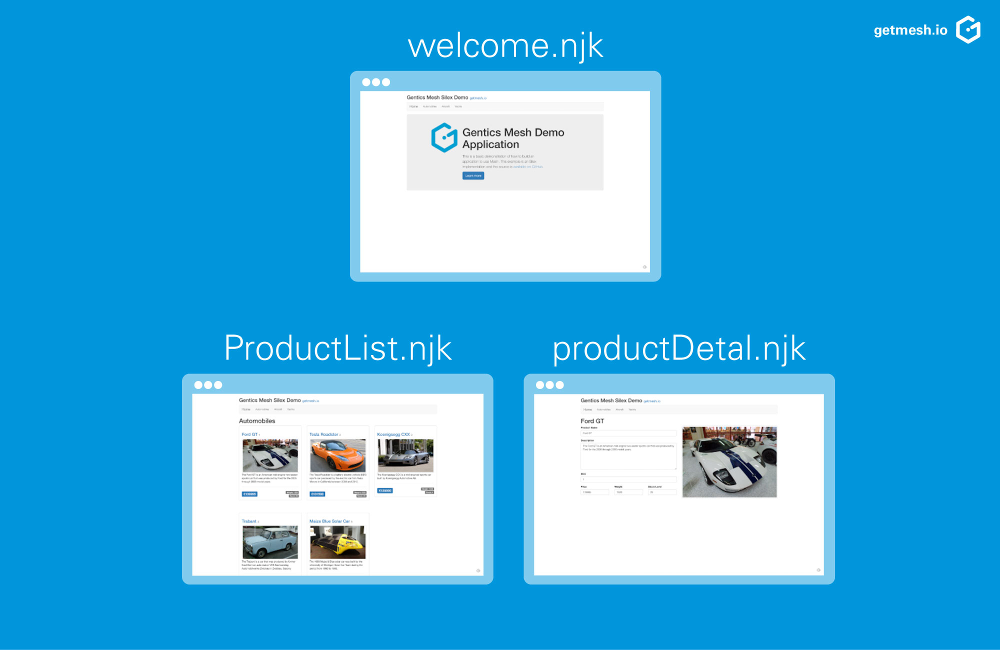

Gentics Mesh is the CMS backend for your web applications and apps. It's API-first so you can choose your favorite languages and frameworks. In this blogpost we are going to provide you with an example for getting started with Gentics Mesh and link:http://expressjs.com/[Express] together with the link:https://www.npmjs.com/package/request-promise-any[request-promise library] as well as the link:https://mozilla.github.io/nunjucks/[Nunjucks template engine]. See how easy it is to swap out technologies and check out the exact same link:http://getmesh.io/Blog/Building+an+API-first+Web+App+with+Gentics+Mesh+and+the+PHP+Microframework+Silex[example using the PHP micro-framework Silex together with the Twig template engine].

== Getting Ready

Clone the example from the Gentics Mesh Repository on link:https://github.com/gentics/mesh-express-example[Github]

```
git clone https://github.com/gentics/mesh-express-example.git
cd mesh-express-example
```

Update the node dependencies

```
npm install
```

Download Gentics Mesh & start server

* link:http://getmesh.io/Download[Download Gentics Mesh]

```
# 1. Start Gentics Mesh 
java -jar mesh-demo-0.24.xx.jar

# 2. Start the express server
node index.js
```

== The Example

Once set up you should be able to access the running Express server via http://localhost:3000.

The example consists of a small website which lists various vehicles from our demo data. The vehicles are grouped into categories which can be browsed individually. The example also features a breadcrumb navigation and image handling via Gentics Mesh.

[.blogpost-img]


== Walkthrough

The main logic of our example is located within the link:https://github.com/gentics/mesh-express-example/blob/master/index.js[index.js] file.

The express route handler accepts these requests and processes them. We use the `request-promise` link:https://www.npmjs.com/package/request-promise-any[library] to chain the outbound requests.

The link:https://getmesh.io/docs/beta/#_webroot[Gentics Mesh webroot API] makes it very easy to find contents for a corresponding web path. All request paths are passed along to this API in order to load the corresponding node which contains data needed to render the page.

A node can either be a node of type 'category', 'vehicle' or 'vehicleImage'. The schema type information of a node is used to switch between different pages. Loading a category node, for example, will result in the product list template to be rendered. A product node on the other hand will result in a product detail page.

In this example we use the link:https://mozilla.github.io/nunjucks/[Nunjucks template engine] to render the templates.

The templates are structured and utilize link:https://mozilla.github.io/nunjucks/templating.html#extends[template inheritance] which is a great way to reuse common parts.

The `base.njk` template contains the needed includes and definitions for the link:http://getbootstrap.com/[Twitter Bootstrap] template.


By default a breadcrumb navigation is added to each page. We moved the code for the navigation into the `navigation.njk` file. The Gentics Mesh link:http://getmesh.io/docs/beta/#_navigations[Navigation Root API] is used to load the needed breadcrumb information for the root level.

Hint: In our example only a single level is used and as such the navigation is not changing. In more complex examples the Navigation Root API can also be used to build up multi-level menus which can also be affected by user permissions.

The `welcome.njk` template just displays some information about the example for requests to the index page. (e.g.http://localhost/).

The `productList.njk` template is used to display categories. A category can contain multiple products. The template uses a simple loop which iterates over all products in order to display each one. The `/api/v1/demo/nodes/:categoryUuid/children` endpoint of Gentics Mesh is used here to load all products for a certain category.

Hint: All endpoints which return lists of items can be easily paged. If you plan to display many more items it would be good to also render a paging element.

The `productDetail.njk` template is used to display all product information on a single page. In this case it is sufficient to pass the resolved Node directly to the template. The needed files can thus be directly used. e.g.: `{{ product.fields.description }}`.

We hope this example was informative and showed you how easy it is to utilize Express in combination with Gentics Mesh to build a small template-based website.

You can also find it on Github: https://github.com/gentics/mesh-express-example

== Related articles
This is the second of a series of articles to show what's possible with our 

API-First CMS Gentics Mesh:

* Building an API-first Web App with Gentics Mesh and the PHP micro-framework Silex
* How to build a website with Go and API-first CMS Gentics Mesh
* Data-driven Apps made easy with Vert.x 3.4.0 and headless CMS Gentics Mesh

Image via link:https://unsplash.com/[Unsplash] by link:https://unsplash.com/@charles_forerunner[Charles Forerunner]