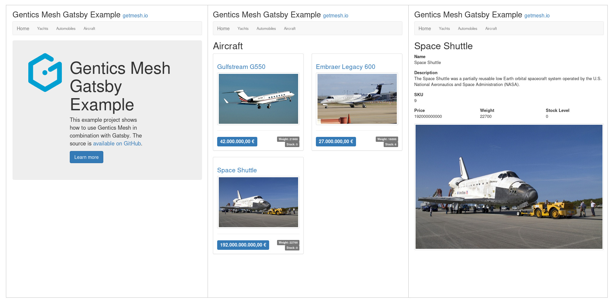

[.blogpost-img]

Building blazing fast websites and apps with content fetched from any data source is the key feature of Gatsby. Today we'll show you how to use Gentics Mesh as a data source. If you're new to Gatsby, that's a universal React-based framework to develop websites and progressive web apps to be deployed on static web servers. After following this blogpost, you will be able to use Gentics Mesh to edit the content that will be shown on your Gatsby-based website.

The full example code can be found on link:https://github.com/gentics/gatsby-mesh-example[GitHub,window=_blank].

== Frontend

The example site is a very simple website that displays vehicles of specific categories. It therefore contains only three different page types:

[.blogpost-img]

The *welcome page* contains a basic intro text and the navigation.
The *category overview* page displays a list of entries of the selected category.
The details page provides the *vehicle view* of the selected vehicle.

Next Steps:

* First, we take a look at the configuration and how Gentics Mesh is used with Gatsby.
* Then, I'll explain how pages are created and how templates are handled.
* Finally, we'll take a look at template and component rendering.
 
== Headless CMS

The contents for the site will be loaded from Gentics Mesh via its GraphQL API. Gentics Mesh is a self-hostable an open source Headless CMS.

== Integration

Gentics Mesh can be added to Gatsby via the link:https://github.com/gatsbyjs/gatsby/tree/master/packages/gatsby-source-graphql[gatsby-source-graphql plugin,window=_blank].

=== Configuration

After configuring Gatsby correctly, the GraphQL API of the headless CMS will be made accessible in the Gatsby API.

.gatsby-config.js
[source,js]
----
…
{
    resolve: 'gatsby-source-graphql',
    options: {
    // Type used to prefix the mesh graphql types
    typeName: 'Mesh',
    // Field to be used to mount the graphql API
    fieldName: 'mesh',
    // Gentics Mesh server url
    url: 'https://demo.getmesh.io/api/v2/demo/graphql',
    }
}
…
----

With this configuration, all GraphQL types of Gentics Mesh will be prefixed with `Mesh` and the whole API made accessible via the `mesh` field.

[NOTE]
====
For this demo we'll use the public Gentics Mesh demo server. It is however recommended to run your own instance. The quickest way to do so is to use docker:

`docker run -p 8080:8080 -d gentics/mesh-demo`.

In that case you need to update the `gatsby-config.js` config accordingly:

* `url: 'http://localhost:8080/api/v2/demo/graphql'`
* `imageBaseUrl: 'http://localhost:8080/api/v2/demo/webroot/'`
====

=== Loading Pages

The `gatsby-node.js` file contains the code that will be used to create all pages in Gatsby.
A GraphQL query is used to load all nodes including their path and used schema.

.GraphQL
[source,js]
----
{
  mesh {
    pages: nodes {
      elements {
        path
        schema {
          name
        }
      }
    }
  }
}  
----

In our example we have only two different types of contents which are sourced from the headless CMS. Two different templates have been setup to be used for those types. The code below will load the pages (called nodes in Gentics Mesh) and create the pages using the matching template. The schema name of each node is used to select the correct template.

.gatsby-node.js
[source,js]
----
const path = require('path');
const slash = require('slash');

exports.createPages = ({ graphql, actions }) => {
  const { createPage } = actions;
  return new Promise((resolve, reject) => {

    // 1. Define set of templates that should be used
    const templates = {
      'category': path.resolve(`src/templates/category.js`),
      'vehicle': path.resolve(`src/templates/vehicle.js`)
    };

    // 2. Run the graphql query to load all pages
    graphql(`
      {
        mesh {
          pages: nodes {
            elements {
              path
              schema {
                name
              }
            }
          }
        }
      }    
    `).then(result => {
      if (result.errors) {
        console.log(result.errors);
      }
      // 3. Create pages for each loaded element.
      //    Use the `page.schema.name` to select the 
      //    matching template. Discard any other page 
      //    that can't be mapped to our templates.
      //    Use the `path` field from the loaded 
      //    element to generate the page
      result.data.mesh.pages.elements
        .filter(page => templates[page.schema.name] != null)
        .map(page => {
          var template = templates[page.schema.name];
          createPage({
            path: page.path,
            component: slash(template),
            context: {
              nodePath: page.path,
            },
          });
        });
      resolve();
    });
  });
};
----

=== Rendering the Category Page

The `category.js` file contains the template code for category overview pages. It renders a `ProductList` which contains a list of `Products`. Each vehicle is in this case represented as a product. The `Product` component renders the tile which contains the image and information on the product.

In Gentics Mesh images will also be loaded from the CMS server. In this example we added the `imageBaseUrl` property to the `gatsby-config.js` file which points to the server from which the images will be loaded.

.templates/category.js
[source,js]
----
import React from 'react';
import { graphql } from 'gatsby';
import { Link } from 'gatsby';
import Layout from '../components/Layout';

function ProductList({ category, imageBaseUrl }) {
  return (
    

      <h1>{category.fields.name}</h1>
      
{category.fields.description}

      

        {category.children.elements.map(product => (
          <Product product={product} key={product.path} imageBaseUrl={imageBaseUrl} />
        ))}
      

    

  );
}

function Product({ product, imageBaseUrl }) {
  return (
    

      

        

          <h3>
            <Link to={`${product.path}`}>{product.fields.name}</Link>
            {" "}
            <small>{product.fields.SKU}</small>
          </h3>

          <Link to={`${product.path}`}>
            
          </Link>
          
{product.fields.description}

          

          

            

              
                {toEuro(product.fields.price)}
              
            

            

              Weight: {product.fields.weight}
               
              Stock: {product.fields.stocklevel}
            

          

        

      

    

  )
}

const intl = new Intl.NumberFormat('de-DE', { style: 'currency', 'currency': 'EUR' })
function toEuro(value) {
  return intl.format(value);
}

export default ({ data }) => {
  const category = data.mesh.category;
  const imageBaseUrl = data.site.siteMetadata.imageBaseUrl;
  return (
    <Layout>
      <ProductList category={category} imageBaseUrl={imageBaseUrl} />
    </Layout>
  );
};

export const query = graphql`
  query ($nodePath: String!) {
    site {
      siteMetadata {
        imageBaseUrl
      }
    }
    mesh {
      category: node(path: $nodePath) {
        uuid
        ... on Mesh_category {
          fields {
            name
          }
          children {
            elements {
              ... on Mesh_vehicle {
                path
                fields {
                  price
                  stocklevel
                  weight
                  name
                  vehicleImage {
                    path
                  }      
                }
              }
            }
          }
        }
      }
    }
  }

`;
----

=== Rendering the Vehicle Page

The rendering process for the `templates/vehicle.js` template is very similar to the category rendering. Additional fields will be loaded to render the view.

=== Navigation

The navigation for the page is rendered via a dedicated component. In contrast to templates we need to use link:https://www.gatsbyjs.org/docs/static-query/[Gatsby’s Static Query feature] to run a query within a component. In our case the query will load only the `name field` and `path` of the categories.

.Navigation.js
[source,js]
----
import React from 'react';
import { StaticQuery, graphql } from "gatsby"
import { Link } from 'gatsby';

export default () => (
  <StaticQuery
    query={graphql`
      query {
        mesh {
          categories: nodes(filter: {schema: {is: category}}) {
            elements {
              uuid
              path
              ... on Mesh_category {
                fields {
                  name
                }
              }
            }
          }
        }
      }
    `}
    render={data => (
      <nav className="navbar navbar-default">
        

          

            <Link className="navbar-brand" to="/">Home</Link>
          

          <ul className="nav navbar-nav">
            {data.mesh.categories.elements.map(category => (
              <NavElement key={category.uuid} category={category} />
            ))}
          </ul>
        

      </nav>

    )}
  />
)

function NavElement({ category }) {
  return (
    <li>
      <Link to={`${category.path}`}>
        {category.fields.name}
      </Link>
    </li>
  )

----

== Running the Application

You can clone the example from github and run it from your machine:

[source,bash]
----
git clone https://github.com/gentics/gatsby-mesh-example.git 
cd gatsby-mesh-example
yarn && yarn develop
----

You can either choose to use this example in combination with the preconfigured Gentics Mesh Demo instance which will be regularly resetted or you can run your own headless 
cms server via `docker run -p 8080:8080 -d gentics/mesh-demo`.

In that case you need to update the `gatsby-config.js` config, as described above.

== Summary

This blog post showed in detail how you can setup Gatsby to fetch content from Gentics Mesh to produce a progressive web app.

Photo by link:https://unsplash.com/@greg_rosenke?utm_source=unsplash&utm_medium=referral&utm_content=creditCopyText[Greg Rosenke] on link:https://unsplash.com/[Unsplash]