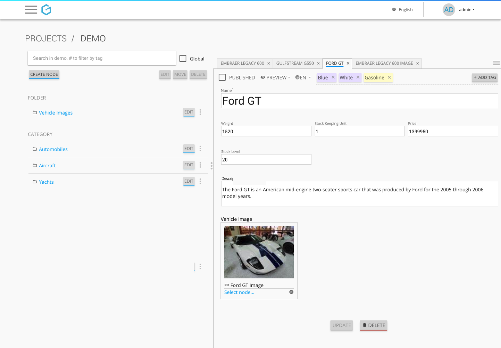
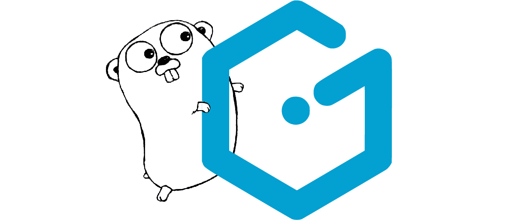

Go is a rising multi-purpose programming language, primarily used for server-side applications because of its speed, concurrency and ease of use. It has a built-in and production-ready template engine and a HTTP server, which makes it an excellent choice for web applications. The following example shows how to create a small web application with Go, using the API-first, headless CMS Gentics Mesh as a backend to manage all the content.

== Go up and running in 3 steps

=== Step 1 - Get Go(ing)
Make sure you have Go installed or set it up as described link:https://golang.org/doc/install[here].

=== Step 2 - Get the headless CMS Gentics Mesh
Likewise download the latest version of Gentics Mesh and start the CMS with this one-liner:

`java -jar mesh-demo-0.24.xx.jar`

No installation needed - it's as simple as that!
Point your browser to http://localhost:8080/mesh-ui/ to reach the Gentics Mesh user interface and use one of the link:http://getmesh.io/docs/beta/getting-started.html#_startup[available demo credentials to login].

[.blogpost-img]

by Gentics

=== Step 3 - Put it all together in the example

Now get and run the example from link:https://github.com/gentics/mesh-go-example[Github]:

[source,bash]
----
go get github.com/gentics/mesh-go-example 
cd $GOPATH/src/github.com/gentics/mesh-go-example 
go run main.go
----

[.blogpost-img]

_by CC-BY 3.0: Renee French. reneefrench.blogspot.com; Gentics_

Now get the hang of it
Navigate your browser to http://localhost:8081/. The example web app is simply a Golang reimplementation of our previous examples in link:http://getmesh.io/Blog/Building+an+API-first+Web+App+with+Gentics+Mesh+and+the+PHP+Microframework+Silex[PHP] and link:http://getmesh.io/Blog/Getting+started+with+Express+and+the+API-first+CMS+Gentics+Mesh[Node.js]: it produces a small website listing vehicles, grouping them into categories and generating detail pages.

== Where to find the main logic?

While our link:http://getmesh.io/Blog/Building+an+API-first+Web+App+with+Gentics+Mesh+and+the+PHP+Microframework+Silex[PHP] and link:http://getmesh.io/Blog/Getting+started+with+Express+and+the+API-first+CMS+Gentics+Mesh[Node.js] examples only used one HTTP route handler, there are two handler functions in this application. I like to use the popular link:http://www.gorillatoolkit.org/[Gorilla toolkit's] excellent routing via `mux` instead of checking if the request path equals `/` in the handler function.

The first `IndexHandler` simply generates the welcome page. The only dynamic content is the breadcrumb navigation.

The second `PathHandler` is more complex. It handles every request apart from the welcome page, including requests to images. It uses the request path to retrieve a node from Gentics Mesh, first determining via the content type header whether the requested node is actually an image. If that's the case, the binary data is simply forwarded to the requesting client. Else, the node is decoded to JSON. Depending on its schema - vehicle or category - the handler renders either a product detail page or product list page. 

== A note on using GJSON to parse Gentics Mesh node objects
The Go programming language is a strong and statically typed language. Working with a struct for every object to unmarshal from JSON is usally the way to go. For small applications with disparate data structures delivered from a backend API like Gentics Mesh, it is often more convenient to treat the API responses as a nested JSON map with arbitrary depth. The link:https://github.com/tidwall/gjson[GJSON] library provides a very fast way of indexing JSON and is used throughout the functions and templates to parse Gentics Mesh node objects.

== See how the templates work

There are three kinds of pages in our example, the welcome pages, product list pages and a product detail page. Every page displays the navigation and the product pages additionally display a category and list of products. This data is given to our templates via the following struct:

The field `Breadcrumb` is used on every page to render the navigation on top. The following `LoadBreadcrumb()` function uses the link:http://getmesh.io/docs/beta/raml/#projectName__navroot[navroot endpoint] of Gentics Mesh to retrieve it.

The `base.html` template is the base of all pages. It includes Twitter Bootstrap, the navigation template on top of the page and below one of the actual content templates.

The `welcome.html` template has no magic going on, just display information about the example when accessing the index page http://localhost:8081/.

`productList.html` is used for displaying all products of a category. It iterates over the field `Products` of the given `templateData` struct, which was populated using the Gentics Mesh `/api/v1/demo/nodes/:categoryUuid/children` endpoint earlier in the handler via LoadChildren() function. The attributes of products represented as `GJSON` values are extracted by the template using the link:https://godoc.org/github.com/tidwall/gjson#Get[Get function].

The `productDetail.html` template renders detailed information about a single product, given as a list with only one element. This might seem strange. One could argue that defining multiple data structs for each different template or even using anonymous structs is a better approach. For the sake of this example's simplicity we keep it to one structure.

== We use session cookie instead of basic auth to increase performance
In this example I'm using a session cookie instead of basic auth to authenticate every request to the Gentics Mesh backend. The main advantage is that Gentics Mesh only needs to check my username and password once at login, resulting in a noticeable performance increase for all subsequent requests.

== Learnings

In this blogpost you have learned how to build a small template-based website, a product catalogue with Go. Gentics Mesh as a headless, API-first CMS has been used as the backend to manage all the product data. Since Go is a typed language I’ve been using the GJSON library to quickly parse Gentics Mesh node objects for the purpose of this tutorial. In real-world applications one would rather implement the model in the application.

Feel free to leave a comment if you have any questions or feedback about this example.

You can also find it on Github: https://github.com/gentics/mesh-go-example

== Related articles
This is the third of a series of articles to show what's possible with our API-First CMS Gentics Mesh:

* link:https://getmesh.io/Blog/Building%20an%20API-first%20Web%20App%20with%20Gentics%20Mesh%20and%20the%20PHP%20Microframework%20Silex[Building an API-first Web App with Gentics Mesh and the PHP micro-framework Silex]
* link:https://getmesh.io/Blog/Getting%20started%20with%20Express%20and%20the%20API-first%20CMS%20Gentics%20Mesh[Getting started with Express and the API-first CMS Gentics Mesh]
* link:http://vertx.io/blog/data-driven-apps-made-easy-with-vert-x-3-4-0-and-headless-cms-gentics-mesh/[Data-driven Apps made easy with Vert.x 3.4.0 and headless CMS Gentics Mesh]

Title image via link:https://pixabay.com/en/marmot-gophers-marmota-munggen-874619/[pixabay]