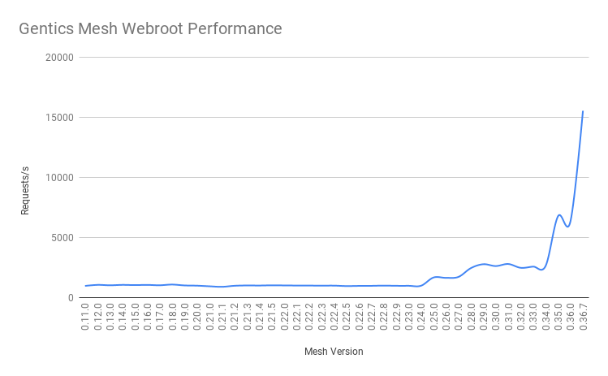
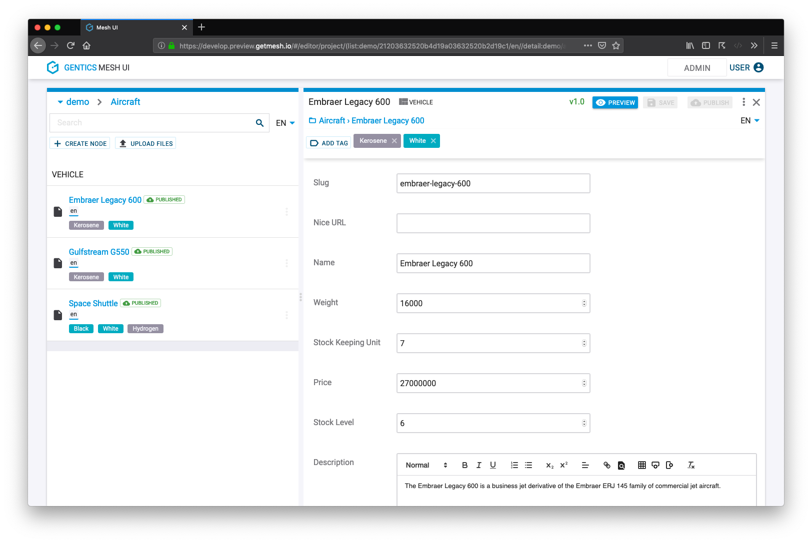

:icons: font
:source-highlighter: prettify
:toc:

## Gentics Mesh History

After *five years* of development with over *6300 commits* we have released Gentics Mesh 1.0. This gives us a good opportunity to look back and reflect the development milestones:

### 2013

In late 2013 we started testing a few framework technologies. This evaluation period continued well into mid-2014.

### 2014

We tested Spring framework, Play framework, traditional JEE approach with JAX-RS.

Finally we settled for link:https://vertx.io/[Eclipse Vert.x] which is a toolkit for building reactive applications on the JVM.

We chose Vert.x because of the modern architecture (event driven, reactive) and because it provided maximum freedom when developing core components.
Vert.x components and features are very light weight and can be enhanced, adapted or quickly replaced with custom code.

*Build on top of battle proven software.*

* link:https://vertx.io/[Eclipse Vert.x] as core
* link:https://netty.io/[Netty] for networking
* link:https://www.elastic.co/[Elasticsearch] for search
* link:https://hazelcast.com/[Hazelcast] for clustering
* link:https://orientdb.com/[OrientDB] for graph database storage

In late 2014 we started development of the core API which included request handling, routing, transaction handling and data storage.

### 2015

In 2015 the core development continued. We added elasticsearch support and announced a closed beta.
One of the earliest projects which used Gentics Mesh also went online that year. The link:https://www.apa-ots-video.at/[APA OTS Video - Video Platform] stores and distributes videos and metadata.

### 2016

While core development continued in 2016, Gentics Mesh was published on GitHub under the Apache license.

### 2017

In 2017 we added GraphQL support, clustering, versioning, content branches and websockets.

++++

{
  node(path: "/automobiles/delorean-dmc-12") {
    ... on vehicle {
      fields {
        name
        weight
        image: vehicleImage {
          path
        }
      }
    }
  }
}

++++

### 2018

Adding more features continued throughout 2018. We added the plugin system, Keycloak support, metadata extraction of uploaded images, geospatial search, focal point handling and many more.

The (to the present day) largest installation went online that year. It currently stores more than two million content elements.

### 2019

We added monitoring support and improved the API performance.

Also, we reimplemented the user interface from scratch, and released version 1.0.

### The future

Who knows what the future brings... To never miss a cool new feature, link:#newsletter[subscribe to our newsletter] or link:https://twitter.com/genticsmesh[follow us on twitter]!
