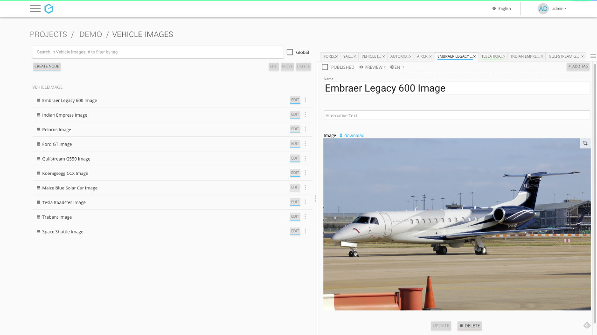
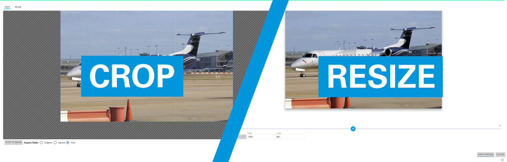
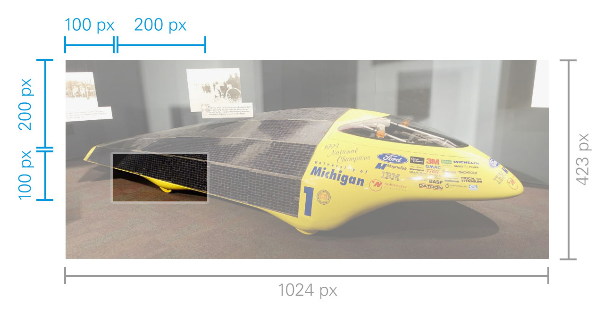

The Gentics Mesh User Interface is the backend of Gentics Mesh. It provides us with the means to create and manipulate our content structure as well as the content itself. As you might have guessed it also provides us with some easy-to-use image manipulation features. So before we take a look at the API, let's take a look at how images can be edited in the user interface.

The Gentics Mesh User Interface
All the images in the demo project shipped with Gentics Mesh are located in the "Vehicle Image" folder node. Of course you can place them in any folder node you like, but we'll stick with the demo project for this introductory article. 

[.blogpost-img]

After clicking on the crop symbol on the top right corner of the image, the image manipulation interface opens. With a few clicks you can crop the image as you like and save it. You are provided with some basic aspect-ratios to choose from. The newly cropped image will be displayed on all requests as well as in every node from which the image is linked. The user interface makes it easy to resize the image too. To do that you can use the built-in slider or directly enter the pixel values.

[.blogpost-img]

== Gentics Mesh API

The user interface works great when you just need to resize or crop a few images. Most of the time that won't be enough so you will need to use the Gentics Mesh Image Manipulation API. We can perform image manipulations on two API end points:

* /api/v1/:YOUR_PROJECT/nodes/:uuid/languages/:languageTag/fields/:fieldname
* /api/v1/:YOUR_PROJECT/webroot/:path

Image manipulations are performed by appending one or more GET-Parameters to the URL. For the image size itself there are two parameters:

* width
* height

If you provide only one of these, the other one will be automatically calculated to fit the original aspect-ratio. If you provide both Gentics Mesh will stretch it to fit the parameters.

For cropping the image there are four parameters:

* cropx
* cropy
* cropw
* croph

cropx & cropy indicate the starting point and cropw & croph the width/height of the returned image. All values are relative to the top left corner of the image.

An authenticated request to `localhost:8080/api/v1/demo/webroot/Vehicle%20Images/maize-blue-solar-car.jpg?cropx=100&cropy=200&cropw=200&croph=100` will result in the highlighted area of this image.

[.blogpost-img]

If you crop and resize the image, it will crop the image first and resize it afterwards, so keep that in mind.

That's it for the image manipulation API and interface in Gentics Mesh. We are looking forward to receiving your comments if you have any questions or feedback! 

Title photo by link:https://unsplash.com/photos/v6Uko9VA-18[Glenn Carsten] via link:https://unsplash.com/[unsplash].