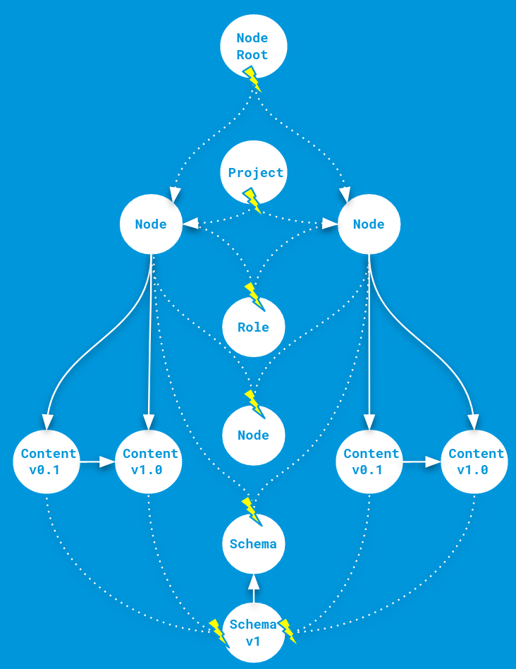
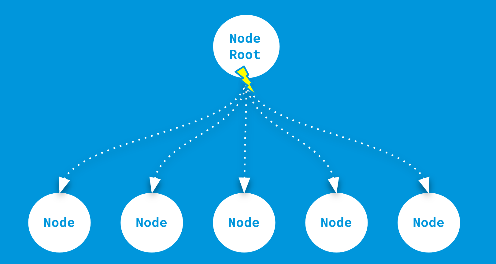
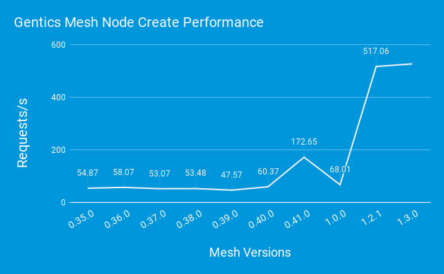

:icons: font
:source-highlighter: prettify
:toc:

== Gentics Mesh Performance Quest

https://getmesh.io/docs/changelog/#v1.2.0

A key goal for Gentics Mesh is to provide a low latency API. We regularly evaluate the write and read performance to check for regressions and to verify that improvements are effective.

Found issues and ideas for future improvements are tracked via GitHub issues.

In the past we focused on read performance improvements. With Gentics Mesh 1.2.0 we introduced major changes to the graph structure which improve the write performance.

=== What affects node create/update performance?

There are a few factors which contribute to the overall request duration.

* Loading
* Writing
* Concurrent Updates
* Cache Invalidation
* Responses

=== Loading

Before an element can be created or updated various other elements need to be loaded. This includes permissions, user information (to be used as creator), project, branches and schemas that should be used for the node.

In Gentics Mesh we use index lookups for most of the needed information. More complex lookups (e.g. webroot paths) are backed by LRU caches.

=== Writing

The new elements have to be added to the graph database. This includes new permissions, new versions, content information and relationship information to other elements (e.g. node has editor xyz).

=== Concurrent Updates

Concurrent Updates which affect the same elements can lead to contention which slows down operations.

Contention is a major factor for performance penalties which can occur whenever multiple operations affect the same element. 

One way to deal with contention is to use locks. In relational databases it is thus advised to construct update queries which ideally result in `Row Locks`. Locking only specific elements and not a whole set (`Gap Locks`) reduces the chance that operations are affected by locks.

Another way to deal with contention is to apply Multiversion Concurrency Control `MVCC`. This process avoids the use of locks and instead increments the version of a modified element. Whenever another operation also modifies the same element the MVCC system will detect this state and inform the database system about the conflict. In case of Gentics Mesh this will result in a re-run of the conflicting transaction. In a high concurrent operation environment this can lead to undesired amount of transaction retries and thus reduce performance. It is thus desired to keep the scope of the affected elements to a minimum.

=== Cache Invalidation

In some cases a request requires internal caches to be invalidated. An update of a role for example will cause the permission cache to be invalidated. Parallel requests can thus influence each other negatively when the cache is regularly invalidated.

=== Responses

Of course building and returing the response to the requestor also affects the request duration.

== Reaching our goals

Now that we have a good understanding on what affects performance we can take a look on how we dealt with these problems in Gentics Mesh.

=== Contention in Gentics Mesh

Contention was single most important factor that negatively affected write performance.

The following information needs to be added when storing a new node in Gentics Mesh:

* Node belongs to specific Project
* Node is based on specific Schema
* Roles have CRUD permissions on Node
* Node has a parent Node
* Node has published Content
* Content uses specific Schema Version

Most of this information will be stored by adding new edges in the graph database.

Adding two nodes in the same project for example will result in new edges between the project and the individual nodes.
Due to MVCC this will thus update the internal versions of the nodes, edges and also the project.
As we learned before this will thus result in a transaction retry whenever this operation happens concurrently.

=== Contention reduction

With Gentics Mesh `1.2.0` we refactored the graph to reduce contention a lot.

We did this by replacing edges which were prone to contention by properties in the node. The information to which project a node belongs is now stored as a property in the node itself.

This solution was also applied for schema, permission and parent node edges.

[.blogpost-img]

=== Super Node removal 

Super nodes or super vertices are elements which aggregate a lot of elements via edges.

By removing the `Node Root` element we also removed a big contributor to contention. This element was previously used to aggregate all nodes of a project. We are now using indices and type segmentation to find the same subset of elements.

This process process also has the benefit that is saves disk space which was previously allocated for graph edges.

[.blogpost-img]

Using super nodes can also affect the write performance on another level. In some cases the write performance can gradually decrease with each edge that was added to the supernode.

=== New Caches

We have added caches for branch names, project names and especially webroot paths. A webroot path no longer needs to be parsed and resolved if it is already stored in the cache.
Webroot requests which provide an etag can thus be answered with minimal graph database access.

=== Results

[.blogpost-img]

== Tips for Gentics Mesh users

* If you don't need etag information you can disable it and thus increase the overall request speed by adding `?etag=false` to your query parameters.
* The `?fields` query parameter can be used to limit the JSON output and thus speed up responses. You may not be interested in all response data when storing nodes. Often `?fields=uuid` may be sufficient.
* When updating nodes it is required to specify the version of the node that should be updated. This would require loading the node first. You can omit this step by using version `draft` instead. This will 
* Apply paging when loading data and load large datasets in chunks.
* Only access `pageCount` and `totalCount` fields in GraphQL when needed. Loading these fields can be costly when having a lot of elements.

More information on performance and tips can also be found in our link:https://getmesh.io/docs/performance/[Performance Guide].

== What's next?

We are already tracking other areas which can be improved to further increase read performance.

* link:https://github.com/gentics/mesh/issues/815[#815 - ETag performance]
* link:https://github.com/gentics/mesh-incubator/issues/233[#233 - Supernode removal]
* link:https://github.com/gentics/mesh-incubator/issues/213[#213 - Optimize JSON encode handling]
* link:https://github.com/gentics/mesh-incubator/issues/149[#149 - Use streaming API for JSON]

== Like what you heard?

If you like Gentics Mesh, let us know by ⭐ing it on link:https://github.com/gentics/mesh[Github, window=_blank]!
Then, if you subscribe to our link:#newsletter[newsletter], we'll occasionally send you updates.
Finally, of course, we are on link:https://twitter.com/genticsmesh[twitter, window=_blank] too!
If you want to get in contact with us, you can either reach us in our link:https://gitter.im/gentics/mesh[gitter chat, window=_blank] or you can post your questions on link:https://stackoverflow.com/questions/tagged/gentics-mesh[stackoverflow, window=_blank].
