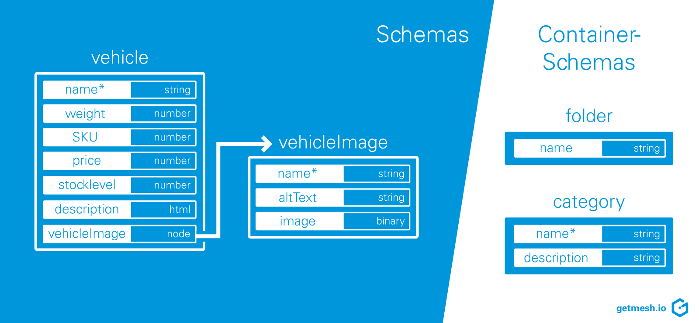
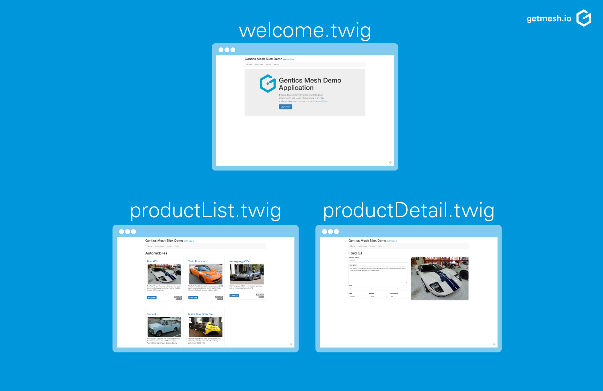

In this blogpost we would like to show you how easy it is to use Gentics Mesh in combination with link:http://silex.sensiolabs.org/[Silex], a microframework for PHP.

== Getting Ready

All needed dependencies were added to the composer.json. You can use the link:https://getcomposer.org/[PHP Composer] to download these.

The following steps are needed to set up the example:

== The Example

Once set up you should be able to access the running Apache instance via `http://localhost`.

The example consists of a small website which lists various vehicles from our demo data. The vehicles are grouped into categories which can be browsed individually. The example also features a small breadcrumb and image handling via Gentics Mesh.

== Walkthrough

The main logic of our example is located within the `index.php` file. Note: The example contains some PHP 7 features. You can also use older PHP versions if you remove the type information from the functions.

All Apache requests will be redirected to the `index.php` file using the `.htaccess` rules. The Silex route handler accepts these requests and processes them.

The link:http://getmesh.io/docs/beta/#_webroot[Gentics Mesh webroot API] makes it very easy to find contents for a corresponding web path. As such all request paths are passed along to this API in order to load the corresponding node.

In our example, a node can either be a node of type 'category', 'vehicle' or 'vehicleImage'. The schema type information of a node is used to switch between different pages. Loading a category node for example will result in the product list template to be rendered. A product node on the other hand will result in a product detail page.

[.blogpost-img]

We use the link:http://silex.sensiolabs.org/doc/2.0/providers/twig.html[Twig template engine] to render the templates. This template format is directly supported by Silex and very easy to set up.

In our example we make use of link:http://twig.sensiolabs.org/doc/2.x/tags/extends.html[template inheritance] which is a great way to structure the templates and reuse common parts.

The `base.twig` template contains the needed includes and definitions for the link:http://getbootstrap.com/[Twitter Bootstrap] template.

By default a breadcrumb navigation is added to each page. We moved the code for the navigation into the `navigation.twig` file. The Gentics Mesh Navigation Root API is used to load the needed breadcrumb information for the root level.

Hint: In our example only a single level is used and as such the navigation is not changing. In more complex examples the link:http://getmesh.io/docs/beta/#_navigations[Navigation Root API] can also be used to build up multi-level menus which can also be affected by user permissions.

The `welcome.twig` template just displays some information about the example for requests to the index page. (e.g. `http://localhost/`).

[.blogpost-img]

The `productList.twig` template is used to display categories. A category can contain multiple products. The template contains a simple loop which iterates over all products in order to display each one. The `/api/v1/demo/nodes/:categoryUuid/children` endpoint of Gentics Mesh is used here to load all products for a certain category.

Hint: All endpoints which return lists of items can be easily paged. If you plan to display much more items it would be good to also render a paging element.

The `productDetail.twig` template is finally used to display all product information on a single page. In this case it is sufficient to pass the resolved Node directly to the template. The needed files can thus be directly used. e.g.: `{{ product.fields.description }}`.

Finally the whole project can also be packaged into a single docker container using the provided `Dockerfile`. The apache rewrite module must be enabled in order to support the `.htaccess` redirection rules.

We hope this example was informative and showed you how easy it is to utilize Silex in combination with Gentics Mesh to build a small template based website.

Feel free to drop a comment if you have and questions or feedback about the shown implementation. 

== Related articles
This is the first of a series of articles to show what's possible with our API-First CMS Gentics Mesh:

* Getting started with Express and the API-first CMS Gentics Mesh
* How to build a website with Go and API-first CMS Gentics Mesh
* Data-driven Apps made easy with Vert.x 3.4.0 and headless CMS Gentics Mesh

You can also find this example on Github: https://github.com/gentics/mesh-silex-example

Title photo by link:https://unsplash.com/photos/RG07Rwkxg6k[Lisa Zoe] via link:https://unsplash.com/[unsplash]