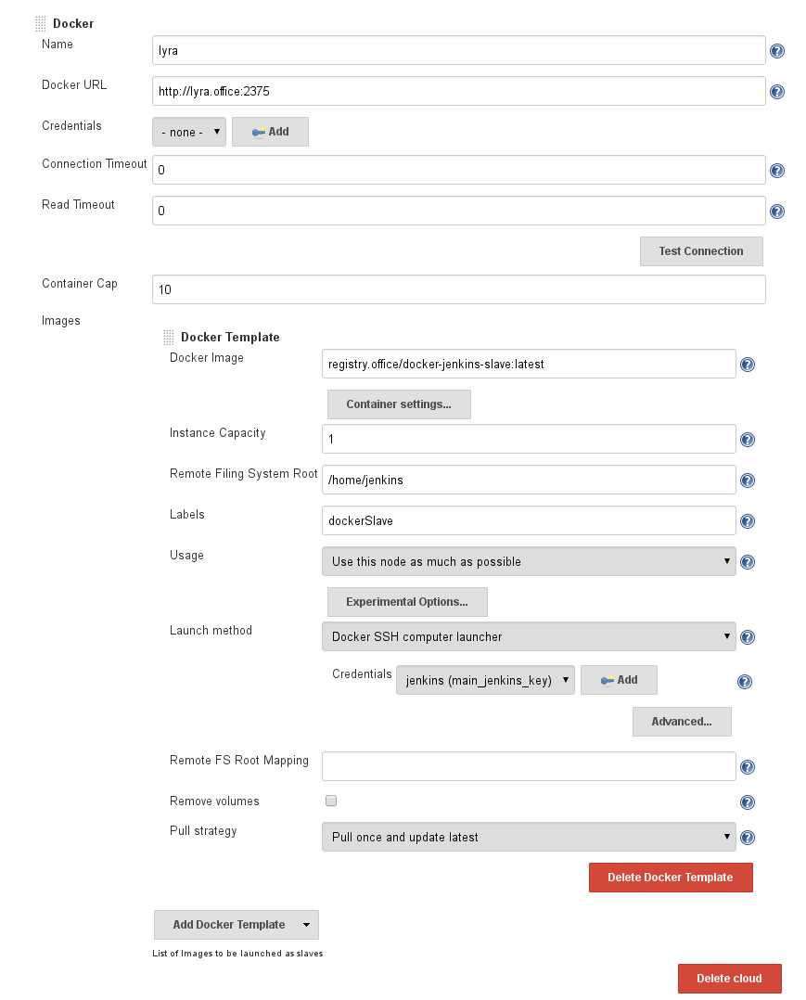

We have recently updated our trusty Jenkins CI server to version 2.x. In this article I want to share my experiences about the new Jenkins 2.x Pipeline plugin.

One of the main changes is the addition of the pipeline feature. The pipeline plugin (formerly known as workflow plugin) allows you customize your Jenkins job via a dedicated Jenkinsfile which is pulled from your SCM project source.

Take a look at the link:https://github.com/jenkinsci/pipeline-plugin/blob/master/TUTORIAL.md[pipeline tutorial on Github] if you want to learn more. The examples and snippets were very insightful and helped me a lot to get started.

I created a small link:https://github.com/Jotschi/maven-release-workflow-test[example project on Github] which I used to experiment with the new pipeline plugin. The example features various aspects which I explain below.

== Jenkins Docker Slaves

I explored a few aspects. First off I wanted to be able to execute all our jobs on Jenkins slaves. The Jenkins master server should not be used to execute jobs. This turned out to be very simple. You just have to setup your slaves and after that it is possible to reference a node within your Jenkinsfile via node('dockerSlave') or via node('!master') if you want to select any node except the master node.

We use docker to provide our Jenkins slaves via the link:https://wiki.jenkins-ci.org/display/JENKINS/Docker+Plugin[Docker plugin]

So far it worked best for me to use the Experimental Availability option "Keep this agent online as much as possible". This way the docker instance is kept online and provisioning of slaves happens much faster. Instance Capacity one means that Jenkins will only fire up one docker container on the docker host lyra. The Container Cap defines the maximum container count for that particular docker host. Jenkins will only fire-up a new docker Jenkins slave if the container cap is not reached.  

[.blogpost-img]

The Jenkins slave image is a custom one which is especially build for our purposes but you can also use a open one from dockerhub. Take a look at the link:https://hub.docker.com/r/evarga/jenkins-slave/~/dockerfile/[evarga/jenkins-slave] Dockerfile if you want to build your own docker image. You basically just need container that exposes an SSH Daemon. Java is needed to startup the Jenkins slave process inside of that docker image. The Jenkins Slave Images I build usually contain also maven, various java versions, nodejs and other build tools.

== Continuous Delivery with Maven

We are currently evaluating whether continuous delivery would be a good option to release Gentics Mesh faster and more often. Applying continuous delivery to a maven project brings up some problems/questions. The maven release plugin is commonly used in order to release maven project. This plugin handles a lot of SCM tasks and takes also care of versioning tasks. (e.g. bumping up the version number). A continuous delivery workflow has some different requirements and thus the maven release plugin may not be the ideals solution.

Axel Fontaine wrote a very link:https://axelfontaine.com/blog/final-nail.html[good article] which shows how to get rid of the maven release plugin. If you decide to to employ Continuous Delivery you should no longer use the maven release plugin. I think it would still be possible to use it since the maven release plugin also supports batch mode but it will just make your life way more complicated than it would need to be.

A really good summary on Continuous Delivery with Maven can also be found in this Stackoverflow answer. It basically boils down the most essential facts. 

My approach is a bit different from the approach Axel took. I'm not employing the scm:tag command. Instead I moved all the SCM logic into the Jenkinsfile. Maven is now only responsible for building the project.

Version schema:

There are various possible version patterns. And so far I have not yet determined the ideal solution.

Possible patterns are:

[options="header"]
|======
| Pattern           | Description
| [major].[minor]-[BUILDNUMBER] | This pattern is not commonly used in the maven eco system but it does not break if the minor number is incremented.

| [major].[minor].[BUILDNUMBER]	| This schema allows easy version comparison and does not break the maven version pattern. Unfortunately the jenkins buildnumber will continue to be incremented even when you manually change the minor number. 
|======

There are also various other patterns. Some include the SCM revision (git short hash). Let us know in the comments what you think are the pro and cons of each pattern.

== Parallel test execution

The link:https://wiki.jenkins-ci.org/display/JENKINS/Parallel+Test+Executor+Plugin[Parallel Test Executor Plugin] can be used to split the test workload across multiple Jenkins slaves. Most of the Gentics Mesh JUnit tests are using a real graph database instead of a mock. Database access layer tests have the advantage that they can catch a lot of database vendor specific issues which would otherwise not be detected. Unfortunately database access layer tests are also a lot slower. I was able to split the Gentics Mesh tests across multiple servers which reduced the test execution time threefold.

== Jenkinsfile

The Junit tests are split using the shown code snippet among all free Jenkins slaves and thus the workload is split.

== pom.xml Profile

The maven surefire plugin needs to be aware of each test batch. This is done by usage of the includesFile/excludesFile parameter. Those parameters will effectively tell surefire to execute only those specific tests.

Pitfalls:

* Make 100% sure that you do not add custom surefire includes in your maven plugin configuration. Otherwise each Jenkins slave may run more tests than actually wanted.

* Make sure that the inclusions.txt/exclusions.txt can be found by the maven module. Unfortunately it is not possible to just place the maven profile into the root pom.xml of your project. A maven submodule will inherit that profile and the relative paths to the inclusions.txt/exclusions.txt may not be correct any longer. 
I have not yet found a generic solution for this issue. My current solution is to place the profile into each submodule. Fortunately most projects I work on only have one module which contains the majority of all unit tests.

Photo by link:https://unsplash.com/@frostroomhead[Rodion Kutsaev] via link:https://unsplash.com/[unsplash]