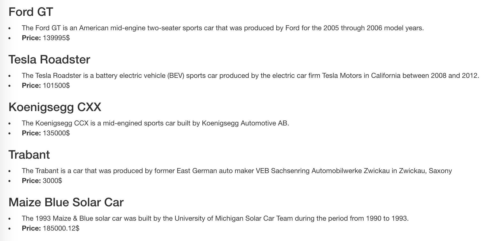
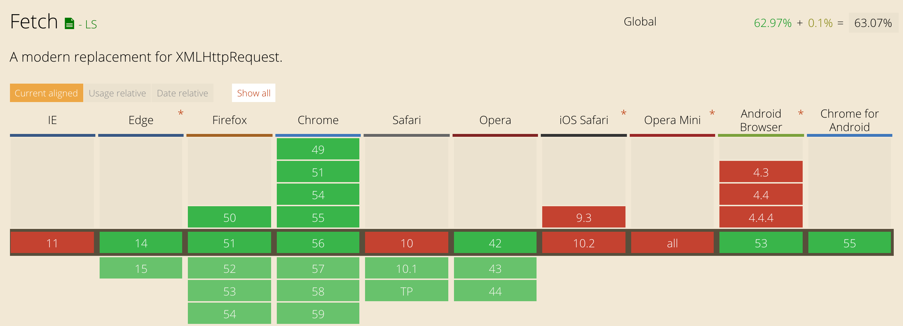

Until recently, XMLHttpRequests were the only way to send AJAX Requests in vanilla JavaScript. Because they were not intended to be used as extensively as they are used nowadays (and because of its ugly syntax) developers used frameworks and libraries to get around this problem. The most popular methods are probably jQuery's `jQuery.ajax()` functions. Lately a new API has a emerged which aims to replace XMLHttpRequest: the link:https://developer.mozilla.org/en-US/docs/Web/API/Fetch_API[Fetch API]. It is now supported by most of the popular browsers out there. In this blogpost we show you how to use the Fetch API and the new Async/Await-Features of ES2017 with the API-first CMS Gentics Mesh.

Gentics Mesh provides API endpoints for us to fetch data from. To get started we need to download and start the Gentics Mesh Server.

link:http://getmesh.io/Download[Get the latest version of Gentics Mesh here!]

Save the file to a new empty folder and enter 

``$ java -jar mesh-demo-x.x.xx.jar``

into your terminal to start the Gentics Mesh server. Once started, you should be able to see it running on 

``http://localhost:8080``

For this blogpost we'll work with the demo project which is automatically included in every new Mesh setup.

== The Fetch API
Let's look at the basic structure of a Fetch API request first:

To communicate with the Gentics Mesh API we need to send an authorization header and some other headers with our requests. We define these options in a new object so we can reuse them later.

We simply pass this object over to our fetch function and set the API endpoint we want to request data from. For demonstration purposes, we'll do a GET-Request to /nodes which returns all nodes of our demo project.

It's time to print the received data, so the user can see it in the browser window. To do that we are fetching data from the `/nodes/bd753cc9b07246e0b53cc9b072f6e070/children` endpoint which returns all automobiles of our demo project.

Hint: bd753cc9b07246e0b53cc9b072f6e070 is the UUID of the "Automobiles" category and all automobiles are children of this folder. The UUID won't be the same in your instance of Gentics Mesh.

As a result you should get something like this:

[.blogpost-img]

== Async/Await in ES2017

EcmaScript 7 provides us with an even more elegant way to fetch data with its Async/Await-Features. Since ES2017 is not yet supported by many major browsers, we need to use link:https://babeljs.io/[Babel]. Babel essentially compiles next generation ECMAScript code to JavaScript that most browsers are able to execute. Basically it enables you to write modern code, that will be supported by browsers natively in the future, without thinking about browser support.

There are many ways to include Babel in your setup as you can see on their link:https://babeljs.io/docs/setup/[setup page]. To just try it out you can include their JS-File in your HTML with ``. This is of course not meant for production.

As you can see in the example, there is no need for `then` blocks anymore. We can simply await the fetch request and other functions to execute before continuing. It makes the code more clean and more readable.

== Conclusion

The Fetch API and ES2017 Async/Await-Features can be used to improve the quality and readability of the code. As you can see on CanIUse, the Fetch API is pretty good supported among modern browsers. In production, you might want to use one of the available polyfills anyway.

[.blogpost-img]

by link:http://caniuse.com/#feat=fetch[CanIUse]

ES2017, on the other side, lacks native browser support. So if you want to program next-gen ECMAScript and can easily integrate Babel into your setup: go for it! Otherwise, you are probably better off using the Fetch API. It really depends on the use case here.

Feel free to drop a comment if you have and questions or feedback about the shown implementation.

== Next Steps

In addition to this blogpost we highly recommend the following resources:

* The link:https://developer.mozilla.org/en-US/docs/Web/API/Fetch_API[Fetch API on the Mozilla Developer Network]
* Another link:https://getmesh.io/Blog/window.fetch%20JavaScript%20polyfill[window.fetch JavaScript polyfill]
* And a fork of the above fetch polyfill allowing for IE8 support also available as link:https://www.npmjs.com/package/fetch-ie8[node package].
* link:https://jakearchibald.com/2015/thats-so-fetch/[That's so fetch] by Jake Archibald

Title image via link:https://pixabay.com/en/adorable-animal-canine-cute-dog-1849992/[pixabay]

