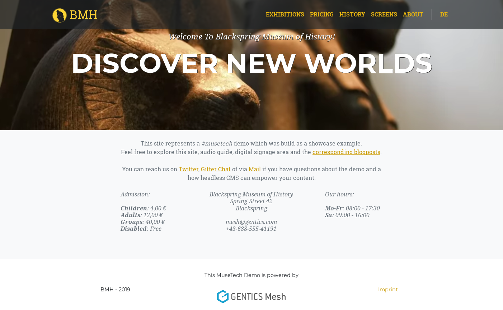
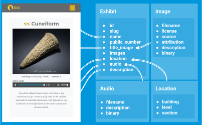
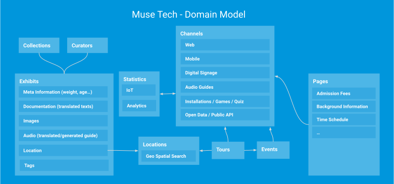
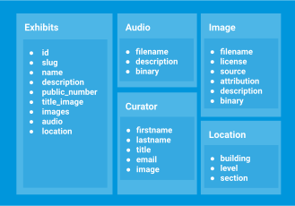
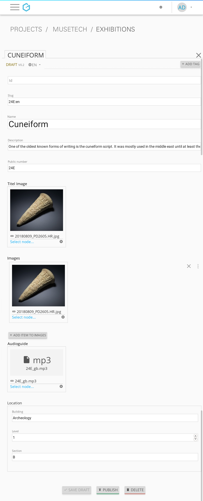
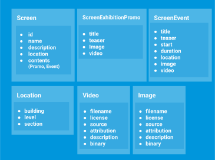
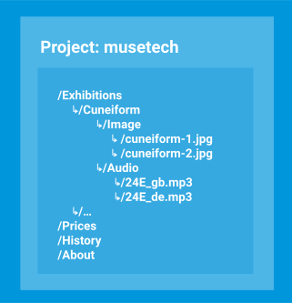
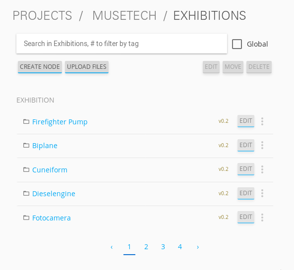
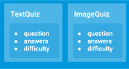

y---
title: Building a museum website from scratch
author: Johannes Schüth
date: 2019-10-10T08:55:01Z
teaser: See how easy a complete website for a (hypothetical) museum can be implemented with Gentics Mesh.
banner_credit: "Giammarco Boscaro"
banner: banner.jpg
---

:icons: font
:source-highlighter: prettify
:toc:

A while ago I built a musetech demo for a customer. I now took this demo and gave it a full facelift and added more features. In this article I want to go into detail on how this project was created. I will cover:

* the essentials explained on a specific part of the demo
* how the front-end was set up
* how GraphQL will be used to load the needed data
* how content has been bootstrapped and how I modelled the content in the headless CMS

After that I want to also give some ideas and thoughts on concepts that are not part of this project but which could also be realized with Gentics Mesh.

// If you want to read about why we think that a headless CMS is a great asset in a musetech / museum environment you can read the link:TODO[first part of out blog post].

The demo website is online and accessible via link:https://musetech.getmesh.io[musetech.getmesh.io].



== The Plan

The essential development workflow was simple:

1. design the pages
2. model the data
3. add some content to be used for development
4. prepare GraphQL to load needed data
5. render data in the front-end

== Data Model

The detail view of an exhibit already makes use of multiple elements.



Each of these elements (the exhibit, the image, the audio, the location) will be represented by one schema in Gentics Mesh.
Once the model and content has been created it is possible to load data via a single GraphQL request:

++++
<div class="graphql-example" data-url="https://musetech.getmesh.io/api/v2/musetech/graphql" style="height: 40em">
<div id="query">
query Exhibit($path: String) {
    node(path: $path) {
      uuid
      path
      ... on Exhibit {
        fields {
          name
          description
          location {
            ... on Location {
              fields {
                building
                section
                level
              }
            }
          }
          title_image(lang: "en") {
            path
            ... on Image {
              fields {
                attribution
                binary {
                  dominantColor
                }
              }
            }
          }
          public_number
          images {
            node(lang: "en") {
              path
            }
          }
          audio {
            path
          }
        }
      }
    }
  }
  </div>
  <div id="variables">
  {"path": "/exhibits/24E:en"}
  </div>
</div>
++++

== Frontend

For building the front-end I chose React. In this section I'll explain how some of the features in the demo were implemented. If you want to fix or add something you are welcome to provide a link:https://github.com/gentics/mesh-musetech-example[pull request].

=== UI Design

The theme for the site is based on the link:https://startbootstrap.com/themes/agency/[BlackrockDigital/startbootstrap-agency theme].
I knew I wanted to present the most important information on the start page. For a museum this often drills down to a few questions:

* When is the museum open?
* Where is it located?
* How much is the admission fee?

Other aspects I wanted to add:

* exhibit overview and detail page
* a set of basic pages (welcome, history, about, imprint, pricing)
* A "screen" area shows the available digital signage. For demo purposes this is accessible via the navigation.

=== React

I used the following React libraries:

* *react-router-dom* for routing
* *react-bootstrap* as a component library for bootstrap
* *react-router-bootstrap* to provide react-router aware bootstrap links
* *react-cookie-consent* for rendering the cookie consent
* *@fortawesome/react-fontawesome* for icons
* *react-slick* for the carousel in the digital signage area
* *vertx3-eventbus-client* for websocket event handling and live update handling

I did not use *redux* or *apollo* to handle state and perform GraphQL requests. The GraphQL queries which I use to load the content are placed in the _api.js_ file and use the plain fetch API.

=== Routing

By default the `Content` component will be rendered. This component takes care of setting up the routes and providing the selected language to the `LanguageContext`.

.Content.jsx
[source,html]
----
export default function Content() {
  return (
    <Switch>
      {/*
        Run the requests with language code via the LanguageContent component
        to set the found language in the context.
       */}
      <Route path="/:lang(en|de)" component={LanguageContent} />
      {/* Redirect / => /en/welcome */}
      <Route exact path="/" component={toWelcomePage} />
    </Switch>
  );
}

function LanguageContent({ match }) {
  let lang = match.params.lang;
  // Provide the found language param to the language context
  return (
    <LanguageContext.Provider value={lang}>
      <Switch>
        <Route exact path="/:lang(en|de)/exhibits" component={ExhibitsList} />
        <Route exact path="/:lang(en|de)/exhibits/:id" component={ExhibitView} />
        <Route exact path="/:lang(en|de)/player/:id" component={ExhibitPlayer} />

        <Route path="/:lang(en|de)/screens/" exact component={ScreenList} />
        <Route path="/:lang(en|de)/screens/:id" exact component={ScreenView} />

        <Route path="/:lang(en|de)/imprint/" component={Imprint} />
        {/*
          All other requests will be handled by the DynamicContent component.
          It will try to load the content for the given path from Mesh and use
          a matching template to render the retrieved content.

          Note the * at the end of the path route. This will allow for multiple
          path segments to be catched by the route.
          */}
        <Route path="/:lang(en|de)/:path*" component={DynamicContent} />
      </Switch>
    </LanguageContext.Provider>
  )
}

/**
 * Redirect the request to the english welcome page.
 */
function toWelcomePage() {
  return (
    <Redirect to='/en/welcome' />
  );
}
----


The `DynamicContent` takes a specific place here. Whenever a route can't be full resolved, the last route `<Route path="/:lang(en|de)/:path*" component={DynamicContent} />` will render the `DynamicContent` component.

This component takes the `path` parameter and sends a GraphQL requests to Gentics Mesh.

NOTE: I think it should be mentioned here that content in Gentics Mesh can be structured in a tree. The GraphQL API allows you to resolve any element via a provided path. Each content element (e.g. folder, page, exhibit) provides a single segment for the path. The _slug_ field usually stores this _segment field_ value.

The effect hook will be used to re-load the content whenever the path changes.

.DynamicContent.jsx
[source,js]
----

let path = match.params.path;
const [content, setContent] = useState();
…

useEffect(() => {
    loadContentByPath(path).then(setContent);
}, [path]);
----

Once the content has been loaded it will be inspected. The GraphQL content can be null when no element has been found. Otherwise the schema name of the located element is part of the response. The schema name will be used to select the matching component that should be displayed.

[source,js]
----
// content is null when graphql did not find a node - show a 404 message
if (content === null) {
    return <NoMatch />;
}
let schemaName = content.schema.name;
switch (schemaName) {
    case "HistoryPage":
        return <History content={content} />
    case "ContentPage":
        return <ContentPage content={content} />
    case "WelcomePage":
        return <WelcomePage content={content} />
    case "AdmissionPage":
        return <AdmissionPage content={content} />
    default:
        return <NoMatch />;
}
----

=== GraphQL

All used queries are located in the `api.js` file. Lets take a look at our previous use case which needs to load the content for a specific path.

The query itself is structured in way so that only the needed fields for the _history_, _welcome_, _admission_ or _content_ page get loaded:

.api.js#loadContentByPath()
[source,json]
----
export async function loadContentByPath(path) {
  return graphQl(`
  query Content($path: String) {
    node(path: $path) {
      uuid
      version
      languages {
        path
        language
      }
      schema {
        name
      }
      ... on ContentPage {
        fields {
          slug
          intro
          title
          text
        }
      }
      ... on WelcomePage {
        fields {
          slug
          intro
          text
          title
          openinghours {
              uuid
              ... on OpeningHour {
                fields {
                  days
                  from
                  to
                }
              }
          }
          museum {
            uuid
            ... on MuseumInfo {
              fields {
                name
                email
                phone
                street
                city
              }
            }
          }
        }
      }
      ... on HistoryPage {
        fields {
          title
          headline
          intro
          timeline {
            uuid
            ... on HistoryEpisode {
              fields {
                time
                subheading
                text
                image(lang: "en") {
                  path
                }
              }
            }
          }
        }
      }
      ... on AdmissionPage {
        fields {
          title
          headline
          intro
          types {
            uuid
            ... on AdmissionInfo {
              fields {
                title
                price
                icon
                description
              }
            }
          }
        }
      }
    }
  }
  `, { "path": "/" + path }).then(response => response.node);
}
----

The query uses link:https://graphql.org/learn/schema/#union-types[conditional fragments on union types] for the schemas to only select the matching fields on the found element. This means that only the needed fields for a `HistoryPage` will be loaded when a history page could be loaded via the provided path.

TIP: If you want to learn more about GraphQL in Gentics Mesh you can link:https://getmesh.io/docs/graphql/[head over to our docs] which also contain some interactive examples.

=== Permissions & Authentication

The content of the demo has been granted read permission for the anonymous role to all content elements. This means that no API keys are needed to fetch the data on the client side. Of course, the permission management of Gentics Mesh would allow for a fine-grained control.

TIP: It is however also possible to use OAuth2 and use the headless CMS as a resource server for authenticated requests. Another option is to hide the CMS server behind a proxy and only allow specific requests.

=== Language Handling


The query that loads the content also contains fields to load the paths for other languages of the loaded content.

```
…
languages {
  path
  language
}
…
```

Loading link:https://musetech.getmesh.io/en/welcome[/en/welcome] via GraphQL would thus also return:

[source, json]
----
…
"languages": [
  {
    "path": "/welcome",
      "language": "en"
  },
  {
    "path": "/willkommen",
    "language": "de"
  }
],
…
----

The `languages` information is passed on the to the `Navigation` component which will use it to render the correct link for the language toggle.

The navigation itself is currently static but it would also be possible to extend our GraphQL query to load the navigation structure.

TIP: Nesting of fragments is usually a good idea when creating a query that loads multiple levels for navigation structures.

In our example, the pages that gets loaded via the `DynamicContent` component do not require any special handling, as the path for the node (e.g. /welcome) is unique for each language. This is enough to let Gentics Mesh know which language you want to load. The matching content will be returned and displayed.

=== CORS

The webserver and the Mesh server in our example have different host names, so we need to take care of a few things, so that link:https://developer.mozilla.org/en-US/docs/Web/HTTP/CORS[CORS] works correctly:

* The frontent needs to know the URL of the Gentics Mesh server - it can be configured in the `app/src/config.json` file.
* Gentics Mesh needs to know which frontend servers shall be allowed to get access -- the following environment variables can be used for that:

```
MESH_HTTP_CORS_ENABLE=true
MESH_HTTP_CORS_ORIGIN_PATTERN="https://musetech.getmesh.io|http://localhost:3000"
```

=== Search

The exhibit list also features a basic search. Under the hood link:https://www.elastic.co/[Elasticsearch] will be used to run a server-side search for the entered query term. In this demo only the `name` field of the exhibits will be searchable.

Adding the search was very easy: A dedicated state was added to store the entered query. The input field updates the query term whenever the `onChange` event got triggered.

```
const [searchInput, setSearchInput] = useState();

…

<input type="text" placeholder="Filter" onChange={({ target: { value } }) => setSearchInput({ query: value })} />
```

When the `searchInput` changes, the effect hook gets triggered which will in turn run a GraphQL query via `filterExhibits` when a query term is present.

```
useEffect(() => {
  if (searchInput && searchInput.query !== "") {
    filterExhibits(lang, searchInput.query).then(setNodeResponse);
  } else {
    getExhibits(lang).then(setNodeResponse);
  }
}, [lang, searchInput]);
```

In Gentics Mesh, Elasticsearch queries can be run via the GraphQL nodes `query` argument:

```
export async function filterExhibits(lang, term) {
  let query = JSON.stringify(createESQuery(term));
  return graphQl(`
  query Exhibits($lang: [String], $query: String) {
    nodes(lang: $lang, query: $query) {

    …

  `, { lang, query }).then(response => response);
}

```

The used query is simple. We want to find all nodes which were created using the `Exhibit` schema and which also match the given term for the `fields.name` field.

NOTE: By default Gentics Mesh already provides some basic Elasticsearch mappings. Strings for example will automatically be index using a trigram analyzer. This is also the reason why the search only returns results after at least three characters. Analyzers, Filters, Stopwords and custom mappings can be configured if wanted to provide very fine control on search behaviour.

[source, javascript]
----
function createESQuery(term) {
  let query =
  {
    "sort": {
      "created": {
        "order": "asc"
      }
    },
    "query": {
      "bool": {
        "must": [
          {
            "match": {
              "schema.name.raw": "Exhibit"
            }
          },
          {
            "match": {
              "fields.name": term
            }
          }
        ]
      }
    }
  };
  return query;
}
----

=== Live Update

The content on the page can be updated instantly. A custom effect will be registered that reloads the content of the page whenever content in the headless CMS changes. You can read more about this mechanism in link:https://getmesh.io/docs/guides/mesh-react-2/[this blog post].

.DynamicContent.jsx
[source, javascript]
----
// Register event callback to update the state when content gets changed in Gentics Mesh
useWebsocketBridge(() => {
    loadContentByPath(path).then(setContent);
});
----

== Deployment

=== Docker

Building the front-end is very simple. I use a multistage docker build for this step:

[source,bash]
----
FROM node:8-stretch as builder
RUN mkdir /app
ADD package.json /app
WORKDIR /app
RUN yarn install && yarn cache clean
ADD . /app
RUN yarn run build

FROM nginx
ADD nginx/default.conf /etc/nginx/conf.d/default.conf
COPY --from=builder /app/build /usr/share/nginx/html
----

The front-end can for example be built via `docker-compose`.

[source, bash]
----
docker-compose build
----

== Content

=== Models

The page should contain a few typical museum site features and explorable information.
I knew I wanted a list of exhibits, an audio guide and present information which are typical in a museum domain.



I ended up creating a few schemas for various content elements. Lets take a look at a few of them.

==== Exhibit

The exhibit model is one of the major parts of the demo. It is used to create Exhibit content elements which are part of the exhibit inventory. A exhibit element should provide:

* Translatable name, description
* Text for the audio guide / References to related audio guide tracks
* Images of the exhibit
* Internal and public archival numbers
* Information about the location within museum



The _Curator_, _Audio_, _Video_ are dedicated schemas for elements which will just be referenced to the exhibit.

The _Location_ is a microschema. Those schemas can be used to model nested content elements that are part of the main content element.

A typical edit form looks like this:



==== Screen

The demo front-end also contains a Digital Signage area. To provide content for this area I also needed the setup the schemas. For Digital Signage it is usually required to provide information for multiple types of screens.

The `Screen` schema will be used to model a specific screen. Each screen displays a set of `contents`. There are two different types of contents:

* The _ScreenExhibitPromo_ is used to promote a specific exhibit.
* The _ScreenEvent_ is used promote a specific event which will take place.



==== Pages

For some pages I knew I wanted to utilize dynamic template handling in my front-end and thus ended up creating dedicated schemas for these pages.

* `AdmissionPage` - Contains a list of `AdmissionInfo` elements which describe the admission fee's and conditions for specific visitor types.
* `ContentPage` - Generic content page which contains a title, teaser, intro and text.
* `HistoryPage` - The history page contains a list of `HistoryEpisode` entries which describe the history of the museum for specific dates.
* `WelcomePage` - The welcome page contains the `MuseumInfo` which stores the location of the museum, the `OpeningHours` of the museum are also stored here.

=== Structure

Each exhibit itself is a container and can thus contain child elements. Images and Audio Guides for the exhibit will be placed within matching sub folders.



Since the exhibit content itself references these child elements it will also take care of loading the matching audio guide translation.



=== Audio Guides

For the audio guides I used link:https://cloud.google.com/text-to-speech/[Google Cloud Text-to-Speech].

The `importer` project contains the `AudioGeneratorRunner` class which uses the google API to transform the description text of the exhibits into `wav` files. The generator is setup to create audio files for both languages.

NOTE: A valid API token is needed to use the Google API.

Finally the generated wav files will be converted to mp3 to reduce the size.

[source,bash]
----
ffmpeg -i input.wav -vn -ar 44100 -ac 2 -ab 96k -f mp3 output.mp3
----

TIP: I think text2speech plugin would be a great use case for a Gentics Mesh plugin. A plugin could be created which generates the mp3 files on the fly and return cached mp3's for text that has already been transformed.

=== Import

The importer is a small Java program which will setup the projects, schemas and finally add the content to the headless CMS via the REST API.

The importer executes the following tasks:

* Create *project*
* Create *microschemas* and assign microschemas to project
* Create *schemas* and assign schemas to project
* Create basic *folder structure* in the project (e.g. Folders for images, videos, exhibits)
* Create the *contents* (e.g. Exhibits, Videos, Images, Audio Guides, Screens, Pages)
* Finally grant anonymous *read permissions* to all content so that the read-only data can be loaded without the need of a JWT.

The importer itself has a data directory which contains a set of folders and JSON files which contain information about the content. Schemas and microschemas are plain JSON files which contain information about the structure of the content.

The pages are located in the *nodes* directory. A node is a basic content element in Gentics Mesh. There are two files for each translation. Translations share the same UUID.

NOTE: Curators and events are currently not imported. We may add those in future versions of the demo.

The *ImportRunner* contains the main class to run the importer.


== Ideas

Of course I had a lot ideas in mind when building the demo. Some of those made it in the demo and some have been omitted. I want to share what else could be done and how I would approach it.

=== Area Search

Gentics Mesh supports geospatial search. One use case would be to present exhibits which are near to the exhibit that is currently being displayed.

=== Quiz

Some museums provide options to create a custom quiz for their visitors. This could also be modelled in a headless CMS.



Each exhibit would get a set of quiz entries. A custom search could be setup to find a number of entries. A teacher could author the questions and provide them to the pupils.

=== IoT

The initial demo I prepared also featured an example for IoT connectivity. The idea was very basic: Have an IoT sensor which is hooked to the front-end. Interacting with the sensor would cause a reaction in the front-end.
For my demo I showed how an ESP8266 microcontroller and a radar sensor can be used to trigger a video on any part the website. This concept could be extended and used to build interactive displays.

The microcontroller ran an link:https://www.arduino.cc/[Arduino] sketch which would dispatch an event via the Gentics Mesh eventbus websocket whenever the sensor was triggered.

The link:https://github.com/gentics/mesh-musetech-example/blob/master/esp/client/client.ino[Arduino Example Code] can be found in the repo. You can also read more on how this mechanism works link:https://getmesh.io/docs/events/#iot[in our docs].

== More…

Thank you for your time. I hope you enjoyed this blog post. Everything that was needed to build the project is on link:https://github.com/gentics/mesh-musetech-example[GitHub].

We also have some other guides on React in our documentation which you might like:

* link:https://getmesh.io/docs/guides/mesh-react/[React & Mesh - Basics]
* link:https://getmesh.io/docs/guides/mesh-react-2/[Read & Mesh - Event Handling]

Photo by link:https://unsplash.com/@giamboscaro?utm_source=unsplash&utm_medium=referral&utm_content=creditCopyText[Giammarco Boscaro] on link:https://unsplash.com/[Unsplash]
