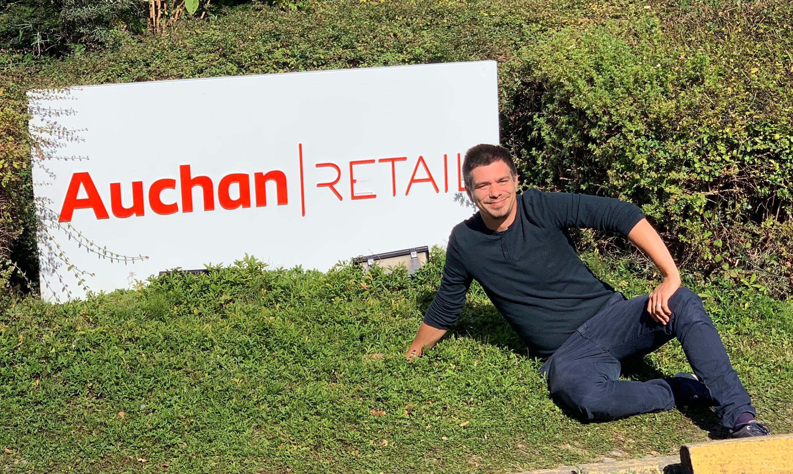
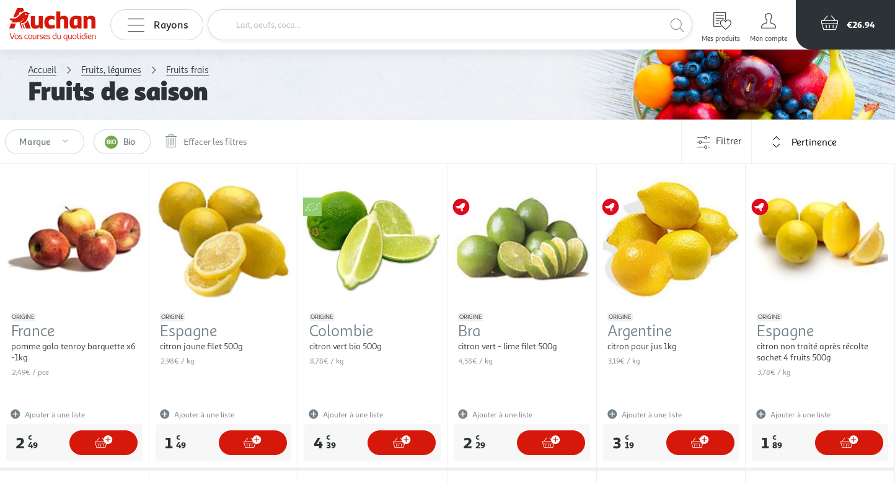
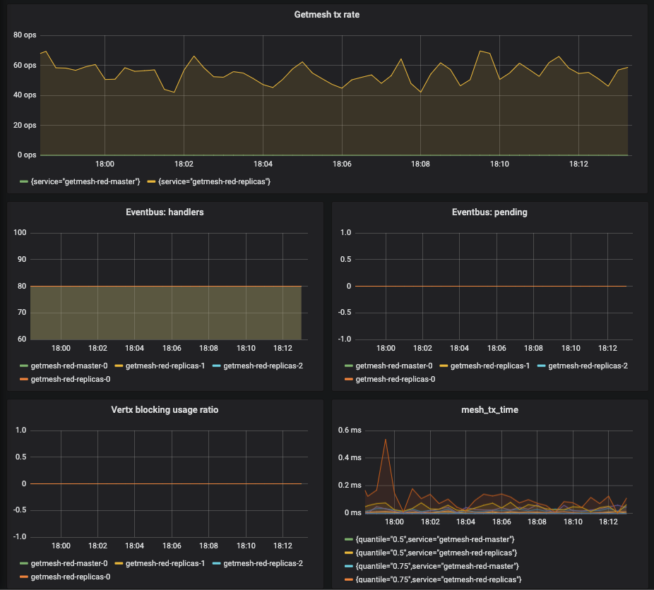

:C: Clément
:CS: {C} Schockaert
:PG: Philipp Gortan
:figure-caption!:

== How Auchan merged 3 webshops into 1 leveraging Gentics Mesh

[.question]
*Philipp:* Hi Clément, can you tell us a bit about your person and the company you work for?

*{C}:* I’m 34 years old and I work for Auchan Retail France in the digital IT department as a software architect since October 2015. Auchan is a multinational retail group with its headquarters in France. It employs over 350.000 people in 4000 locations.

My unit is part of the IT department in Lille, it comprises of 50 people and is responsible for the company’s e-commerce solution. The teams in this unit have around 5-6 people each, with every team focusing on different aspects of the e-commerce application: product display, checkout, search engine, customer relationship, content management, etc. All teams are full-stack and cross-functional, which means they cover backend and frontend development, devops, production support, product owners, software architects, quality assurance and user experience experts, ...

As a software architect, my role is to take part in all the main decisions regarding what we build and how we deploy: from the development environment via continuous integration to the production environment. I ensure that the right frameworks are chosen, code is reviewed, and all sorts of technical problems are resolved. In particular, I took a very important role in the process of integrating Gentics Mesh into our ecosystem, and I’m now the go-to guy for Gentics Mesh at Auchan. I’m directly attached to a feature team so I’m also contributing code to the projects.

.{CS}

[.question]
*Philipp:* Thanks for the introduction! What is the project that you are currently working on?

*{C}:* In the past, we had different websites for our home delivery service, our cash & carry business and our corporate website. In 2017, a project was started with the goal of merging these into a single website https://www.auchan.fr[auchan.fr,window=_blank] in an effort to regroup all of Auchan’s brands into one. The new website is to *serve 7,5 million page views per day*!

[.question]
*Philipp:* Wow, these are impressive figures! What tech stack did you choose that is able to deliver this performance?

*{C}:* On the server, we developed a Java application that uses Spring Boot, Spring Cloud, Spring WebFlux and Reactor. HTML rendering is done using Thymeleaf. Database-wise, we use PostgreSQL for relational data, MongoDB for NoSQL, and Elasticsearch for full text search.

On the client, we follow a *micro-frontends* concept: Each team develops microservices (both API and frontend) that are responsible for rendering a small fragment of the web page. Each fragment consists of vanilla Javascript code (actually, ES6 modules) that we assemble on the server using Zalando’s Tailor.footnote:[Read more about Tailor and micro frontends in this https://www.oreilly.com/ideas/better-streaming-layouts-for-frontend-microservices-with-tailor[blog post,window=_blank]]

[.question]
*Philipp:* When you started your project, did you go straight ahead looking for a headless CMS, instead of looking into traditional databases, or conventional web content management systems? Which were the key factors that pushed you in the direction of headless?

*{C}:* Our previous version of our website auchan.fr was based on Hybris (now part of SAP C/4HANA) and was deployed on premise with our partners at Orange Business. We highly customized Hybris to our needs (even rewrote some Java parts of it), but the CMS part of Hybris is mainly unmodified. Hybris is not an open source solution and is neither microservice-oriented neither cloud-friendly, so when our team was tasked to merge auchandrive.fr into auchan.fr, we decided that it was time for a fresh remake of the website. The user interface wasn’t mobile-friendly either, so we redesigned the frontend stack from scratch with a *mobile-first* approach in mind.

The CMS plays a really big part in such a project, as the client-side rendering depends heavily on commercial and dynamic content that will be adapted depending on:

* the page type you are on (a product, a product list, a search result, the homepage, etc)
* which physical store your account is connected to
* which device you are using

All these parameters influence what will finally be rendered for the client.

So, when we started the project in 2017, we knew that we would not use the CMS provided by Hybris for the re-implementation again, because it cannot be decoupled from the monolithic Hybris stack, and provides no REST APIs. With all sails set towards a *microservice* architecture, it was clear to us that we would go for a headless CMS.

.Screenshot auchan.fr

[.question]
*Philipp:* In the end, you decided to use Gentics Mesh as your headless CMS. Which other solutions did you take into close consideration?

*{C}:* I don’t remember having found any serious competition to Gentics Mesh that would meet our requirements:

* highly customizable, flexible content model
* microservice oriented
* clustering support
* Docker support
* a REST API
* comes with an admin UI
* builtin backup/restore
* good documentation
* an active community
* open source

[quote, {CS}]
I don’t remember having found any serious competition to Gentics Mesh that would meet our requirements.

Besides Gentics Mesh, we looked at the commercial Craft CMS, but quickly decided to go with Gentics Mesh: Craft CMS lacked the documentation comparable with Gentics Mesh’s API developer documentation. You know, as a developer I don’t like losing time and getting the grasp of it in the first few minutes is crucial to me. In less than 1 hour I understood how Gentics Mesh works -- and this was not the case with Craft CMS -- so we decided to use Gentics Mesh.

[quote, {CS}]
In less than 1 hour I understood how Gentics Mesh works.

Gentics Mesh was in _beta_ when we started the project -- and even when we went live -- but we were ready to take the risk. It’s now an almost stable solution -- as long as we don’t update production right after every release :-)

[.question]
*Philipp:* Of all advantages of Gentics Mesh you mentioned, which one would you see a the most important for you?

*{C}:* Getting started very fast with the demo JAR was really important, and having such a good documentation!

[.question]
*Philipp:* Awesome, that’s great to hear… And where did you face the biggest problems?

*{C}:* As in all IT projects, there were many problems to be solved -- most of them were not related to Gentics Mesh. The biggest challenges related to Gentics Mesh were: how to handle upgrades, backup and restore in our clustered cloud environment. I had to customize a lot in this area in order to find working solutions for us. Furthermore, there were some obscure problems with the underlying database OrientDB, which still doesn’t feel as stable as traditional relational databases. That’s why we are test new versions for some weeks in our staging environment before doing major upgrades on production.

[.question]
*Philipp:* We can feel your pain, and we are constantly working together with OrientDB in order to improve the stability of the underlying database. In fact, most releases in 2019 contained improvements in this area. Now that you are in production, I assume that apart from stability, performance becomes a key part to your success. How well do you fare in that regard?

*{C}:* Read performance is the most important thing to us! Write performance is way less critical, as the data gets updated mostly by batch jobs and sometimes manually. Therefore, we designed our *cluster* to have a single master node and multiple read-only replica nodes. This way we can freely *scale up* replica nodes when load increases. In our current setup we normally have 1 plus 2 nodes -- but we expect traffic to grow by the factor of 10 when all parts of the legacy websites have been migrated. All read requests accumulated (with 1 minute upstream caching) we will see peaks of about 1.000 requests per second.

[quote, {CS}]
This way we can freely scale up replica nodes when load increases.

.Kibana Dashboard for Gentics Mesh

[.question]
*Philipp:* Wow, once again I have to admit, these are impressive numbers! On which infrastructure do you host your application?

*{C}:* For this project, we moved to the Google Cloud Platform and are using *Kubernetes* for container orchestration. We already had prior experience with alternative orchestration architectures, Apache Mesos and Docker Swarm to be specific. For this project, however, we decided to use a completely new stack, where Gentics Mesh and all other microservices are deployed in a Kubernetes cluster, with a *Helm chart* to package the application, and a Gitlab CI pipeline for continuous integration. The Helm chart not only runs Gentics Mesh, but also takes care of configuring the cluster, setting up backup, monitoring, starting the search engine, mounting shared storage for uploaded binaries, etc. By the way, we’ve open-sourced the Helm chart footnote:[you can find the Helm chart on https://github.com/cschockaert/getmesh-chart[Github, window=_blank]] as we believe it is useful for other users too!

[.question]
*Philipp:* That sounds great! Thank you very much for taking the time to share your story with us. We’re really excited to have Auchan amongst our users, and we wish you continued success in this project! Please keep us posted!

****
This is a transcript of an email conversation between {CS}, software architect at Auchan Retail France, and {PG}, head of product development at Gentics.
****
