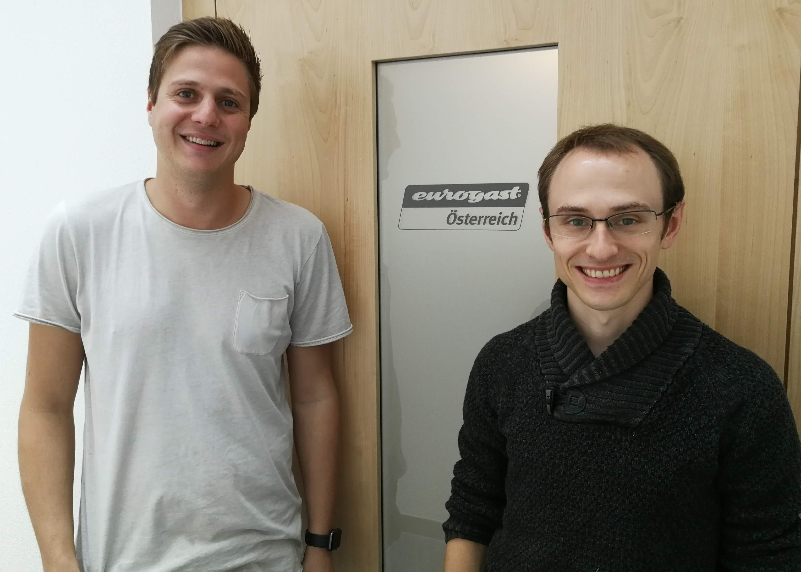
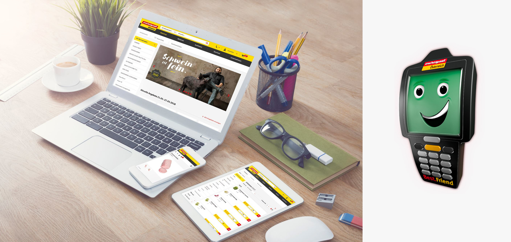
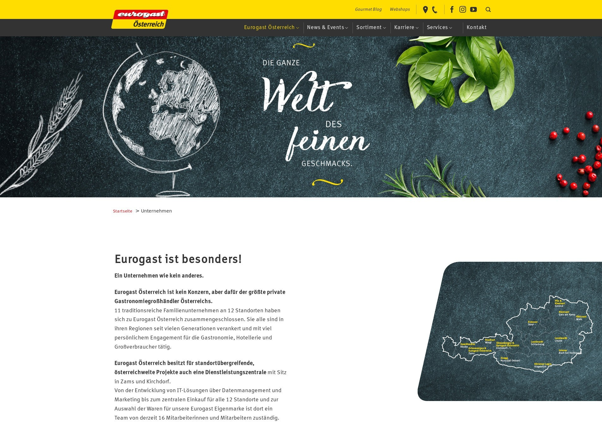

:JG: Johannes Geiger
:KR: Karl Regensburger
:PG: Philipp Gortan
:EG: Eurogast
:EGO: Eurogast Österreich
:figure-caption!:

== {EG} runs 15 Mesh-based webshops

[.question]
*Philipp:* Could you please introduce yourselves and the company you work for?

*Johannes:* I’m with {EG} since the beginning of this year. I started in the ERP team but during the upcoming months I take over the lead for our B2B e-commerce solutions from Karl.

*Karl:* I joined {EG} in 2016, at a time where the company decided to found an IT department. Currently, I am the project manager for all our B2B e-commerce solutions including our webshop and handheld device called Best.Friend, which is basically a portable scanner used by customers in restaurants, hotels and canteens.

{EG} is in the groceries wholesale business (like Metro, Transgourmet, AGM), but unlike the others it is formed by eleven independent wholesale companies that have combined their forces in purchasing, marketing and recently, also in IT. Amongst other things our IT department is responsible for the B2B e-commerce solutions we provide for our eleven members.

{EG} started having a webshop in early 2000 and the first solution was used for an incredible timespan of almost 15 years. However, five years ago _{EGO}_ decided to bring the shop up-to-date regarding design and user experience on mobile devices. Back then, {EG} switched to a solution based on Magento Enterprise. Unfortunately, changes in the licensing policies forced us to look for a more cost efficient solution about two years ago. In 2018, our software evaluation ultimately lead us to a custom webshop solution following a best-of-breed approach while relying on a well-known container platform.

.{EG} website on multiple devices and the {EG} Best.Friend (© istockphoto.com/mactrunk)

[.question]
*Philipp:* There are many ways to build a webshop and integrate content -- why did you pick a headless CMS as the basis?

*Karl:* We were not specifically looking for a headless CMS in the beginning. However we immediately bought the headless CMS concept when one of the evaluated companies showed us how a headless CMS allows us to employ content types that can be defined centrally and then be filled with content by our editors, without the need to fiddle with HTML, CSS, or Javascript code.

In contrast, in the Magento CMS you have one large input field where you can enter anything, including Javascript or HTML code, potentially leading to a broken site. We wanted a solution where the content team *neither needs HTML nor CSS skills*.

Furthermore, the necessity to push the same content onto multiple current and future channels, e.g. the *webshop* that represents the website for each {EG} member -- and who knows what else may be coming -- made it clear that the CMS must not define the layout of the content, but that it needs to be independent and different for each channel.

As a result, in February 2019 different headless CMS solutions where evaluated. As there was little to no budget at hand for the CMS, only *open source* options were considered.

[link=https://eurogast.at/,window=_blank]
.Screenshot eurogast.at

[.question]
*Philipp:* With at least thirty open source headless CMS implementations to choose from, what were the main features that lead you towards Gentics Mesh?

*Johannes:* We started looking for a headless CMS with *multi-tenant capabilities* -- which made the search difficult because no headless CMS out there markets itself with this term. But as our use-case requires us to manage the content centrally for 15 webshops websites with different editorial teams, this was a hard requirement. Together with our implementation partner https://www.catalysts.cc/[Catalysts,window=_blank], we found that our requirements were best covered with Gentics Mesh, as this headless CMS has the concept of multiple projects that can share the same schema definitions. So after a few weeks of research, we were ready to make our decision. Right after the decision was made, we created our schemas and implemented the frontend parts, and within 3 or 4 weeks we were able to deploy the CMS in production and start serving content to the frontends.

[quote, {JG}]
Right after the decision was made, we created our schemas and implemented the frontend parts, and within 3 or 4 weeks we were able to deploy the CMS in production and start serving content to the frontends.

[.question]
*Philipp:* That’s an impressive timeline, congratulations to that! How is your project structured?

*Karl:* Each of our 15 webshops has its own editorial team that needs to be able to edit its own content, but not the content of the other webshops, while we have to guarantee that the structure of the content is absolutely consistent over all webshops. Most headless CMS solutions on the market are designed to serve a single website. In comparison, Gentics Mesh supports *multi-website* setups out of the box. Each website has its own project, but the same schemas can be assigned to all projects, assuring consistency. This was a big win for us!

Thanks to the JSON editor that is part of the schema editor UI, schema migrations from staging to production are also really easy. And the groups and roles allow us the set *permissions* for all users of one editorial team consistently, restricting the editorial access to their assigned project.

Besides serving the page content, the navigation and the footer is also rendered using only data stored in Gentics Mesh -- so the editorial teams can perform changes to these parts of the website too, without having to get in touch with IT. The GraphQL API allows frontend applications to fetch all this information with a single request.

While evaluating different solutions, we found some that had a more intuitive user interface compared to Gentics Mesh, but they would not have scale to multiple websites and editorial teams. All our use-cases could be covered with the Mesh User Interface, so this was no deal-breaker.footnote:[Release 1.0 of Gentics Mesh will feature a completely new UI implementation that should tackle the mentioned shortcomings.] Another big bonus was the documentation that comes with Gentics Mesh, that is miles ahead of what most other implementations offer. Also, the short release cycles kept the deltas small and updates easy.

We liked the idea of being able to implement improvements to Mesh ourselves, as it is open source software. In the end, our development team at Catalysts could actually publish two improvements to the Mesh UI!

And best of all, the fact that Gentics Mesh comes with a *docker image* that can be directly used in production -- which was a perfect fit for us, as we run everything on Openshift, which as you probably know, relies on Kubernetes.

[quote, {KR}]
Gentics Mesh supports multi-website setups out of the box. Each website has its own project, but the same schemas can be assigned to all projects, assuring consistency. This was a big win for us!

[.question]
*Philipp:* Now that we have mentioned Kubernetes, can you give us a short overview of your tech stack?

*Karl:* Sure! The text content and media files like images, PDFs etc. are all managed in Gentics Mesh, while the frontend applications (the webshops and future applications) combine this content with product data coming from our ERP systems.

Our hosted Openshift platform runs Gentics Mesh, but also our webshop frontend, a business logic application called "hub" and some applications for our handheld device. Besides Gentics Mesh, Catalysts also recommended a lot of other open source components like MariaDB, ElasticSearch, Graylog, Keycloak, RabbitMQ that are all great open source software projects. Of course, Catalysts also brought some proprietary components that they had already developed in previous customer projects, reducing the development effort.

Mesh is running stable in a single-node setup at the moment, where we use a 3-node cluster for ElasticSearch. It has 3GB of RAM and 0.5 cores assigned, which makes the frontend applications perform great (caching helps here of course), while the backend could use some performance boosts. We’ll hope to see some improvements with the next Gentics Mesh releases, but also with configuration tweaks.

[.question]
*Philipp:* We’ll be happy to assist in that with our consulting team. Thank you so much for having this call and sharing your success story with us!

****
This is the translated transcript of a video conference held in August 2019 between {KR} and {JG}, both IT project managers of _{EGO}_, and {PG}, head of product development at _Gentics_.
****
