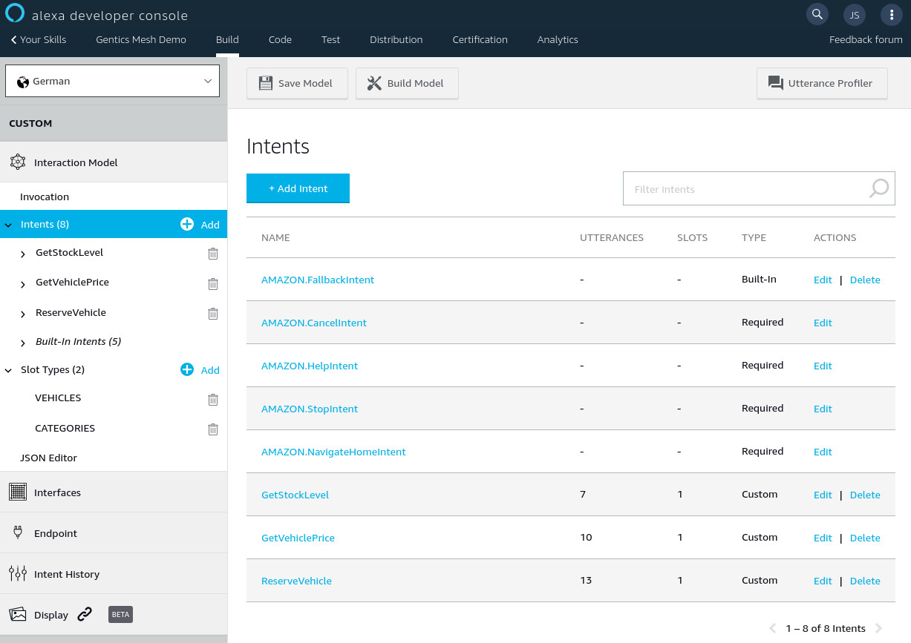

:icons: font
:source-highlighter: prettify
:toc:

== The Goal

The goal of this small project was to create a custom Amazon Alexa Skill. A skill is a way to extend the functionality of Amazon Alexa by defining a custom interaction model and an endpoint to which the Amazon Services can connect to.

The skill itself is very simple. It allows the user query information about prices and stock levels from a link:https://demo.getmesh.io/demo/[demo vehicle store].

`Alexa, ask Gentics whats the price of a Tesla?`

`Alexa, ask Gentics whats the stock level of Tesla?`

*Components*:

* Interaction Model - The model defines what kind of sentences trigger which code in our server
* HTTP Server - A server which runs the handlers. I use Vert.x to handle the server part
* Handlers for intents - The server needs to have some handlers which will be triggered by the Alexa service
* I18N mechanism - The skill should be usable in multiple languages
* Glue - To combine all code pieces I use dagger which is a dependency injection framework

== Amazon Alexa


Before you can start with your server you should setup your skill in the link: https://developer.amazon.com/alexa/console/ask[Alexa Skills kit Developer Console].

There are various link:https://developer.amazon.com/alexa-skills-kit/learn[great guides] that explain all the details of the Alexa skill system. 

Let me try to give you a super condensed introduction of the terms and their meaning.

=== Invocation Name

Your skill has an invocation name. This name is used to trigger or activate the skill. A easy to use name should be used. In our case it is _"Gentics"_.

`"Alexa, open *Gentics*"`

`"Alexa, ask *Gentics* [...]"`

=== Intents

The skill can have multiple intents. Intents are similar to functions/actions which will invoke the handlers in your alexa skill server.

`Alexa, ask Gentics *whats the price of a Tesla?*`

When you define an intent you can actually specify multiple phrases which can be used to trigger the intent.

`Alexa, ask Gentics *how much does a Tesla costs?*`

There are also build-in intents which get triggered when the skill is stopped, a user asks for help or when no matching intent could be found (e.g. the question of the user could not be understood).



The *interaction model* can also be imported and edited via the JSON Editor in the developer console.

I exported the model for german and english language. You can use the link:https://github.com/gentics/mesh-alexa-skill/tree/master/model[JSON files] to setup your skill or create a new interaction model from scatch.

=== Slots

You can define intent slots which work similar to variables in your intents.

`Alexa, ask Gentics how much does a *<vehicle>* costs?`

The alexa service will automatically extract the name of the vehicle and add it to the request which will be send to your skill server.

In the SDK console you can define a slot type for these variables. You can add entries to the slot type to make it easier for the Alexa service to map the intent slots. Additionally you can use slot types to add aliases to names that you were using.

Please note that you don't need to specify all the slot types options. The alexa service will still provide you with mapped intent slots in the request payload. Adding options will however help the alexa service to better map the spoken word to the slot.

=== Endpoint

The endpoint section can be used to define the URL on which the Alexa Skill Server can be reached.

== Intents Handlers

All the intents will be combined using the `SkillIntentHandler` class. The handler will redirect any of the requests to the matching intent handler. Each of the intent handler is injected via dagger and added to the request handlers for the skill.

=== CancelandStopIntentHandler

Intent handler which gets invoked when canceling or stoping the intent.

`Abort`

=== FallbackIntentHandler

Fallback handler which gets invoked when no matching intent could be selected by the Alexa service.

=== GetVehiclePriceIntent  

Custom intent which will identify the selected vehicle and return the stored price.

`What is the price of a Tesla?`

=== HelpIntentHandler

Intent handler which returns information to the user about the usage of the intent.

`Help`

=== LaunchRequestHandler

Intent handler which gets invoked once the Skill gets launched. It can introduce the intent and also give examples what to say next.

`Open Gentics`

=== ReserveVehicleIntent

Custom intent handler which gets invoked when the user wants to reserve a vehicle.

`Reserve a Tesla`

=== SessionEndedRequestHandler

Handler which gets invoked once the session ends. Usually used to cleanup sessions etc.

=== StockLevelIntentHandler

Custom intent handler which gets invoked when the stock level of a vehicle should be returned.

`Whats the stock level for Teslas?`

== The Skill Server

The server needs to accept requests on the `/alexa` endpoint. The intents which have been defined have dedicated handlers in the server code. The handlers process the request and return the response to the alexa service.

Sources: link:https://github.com/gentics/mesh-alexa-skill[Github]

== Dagger

I use link:http://google.github.io/dagger/[Dagger] as the dependency injection framework of my choice.

The link:https://github.com/gentics/mesh-alexa-skill/blob/9beb7d57be153077456aff3ea34896debbd501fe/src/main/java/com/gentics/mesh/alexa/GenticsSkill.java#L28[main] method contains the code which prepares the dagger dependency graph.

Initially a `SkillConfig` configuration POJO will be created. This configuration will be provided to the dagger builder in order to make it injectable.

[source,java]
----
SkillConfig config = new SkillConfig();
applyEnv(config);
AppComponent app = DaggerAppComponent.builder().config(config).build();
app.skill().run();
----

== Vert.x Server

For Http request handling and routing I use link:https://vertx.io/[Eclipse Vert.x] since it is light weight and easy to extend and use. The `link:https://github.com/gentics/mesh-alexa-skill/blob/master/src/main/java/com/gentics/mesh/alexa/server/SkillServerVerticle.java[SkillServerVerticle]` contains the server, routes and handlers.

[source,java]
----
router.route("/alexa").handler(rh -> {
  JsonObject json = rh.getBodyAsJson();
  try {
    intentHandler.handleRequest(json, sr -> {
      Buffer buffer = Buffer.buffer(sr.getRawResponse());
      rh.response().end(buffer);
    });
  } catch (IOException e) {
    rh.fail(e);
  }
});
----

== I18n / Translations

link:https://github.com/gentics/mesh-alexa-skill/tree/master/src/main/resources/i18n[Resource bundles] have been added to the project in order to make the skill support multiple languages.

The link:https://github.com/gentics/mesh-alexa-skill/blob/master/src/main/java/com/gentics/mesh/alexa/util/I18NUtil.java[I18NUtil] handles the i18n lookup. 

Each Alexa API request provides the `HandlerInput` which contains information about the local that has been configured for the client which uses the skill.

[source,java]
----
protected Locale getLocale(HandlerInput input) {
  String localeStr = input.getRequest().getLocale();
  return Locale.forLanguageTag(localeStr);
}
----

Finally the local can be used to get the translation.

[source,java]
----
String speechText = i18n(locale, "vehicle_not_found");
----

== Gentics Mesh

The skill uses the open source headless CMS Gentics Mesh to load and update the information about the vehicles via REST, GraphQL and Elasticsearch queries.

The CMS stores the content for the link:https://demo.getmesh.io/demo/[demo vehicle store].

Some time ago I build a link:https://reactjs.org/[React] demo app which registered itself to the Events of Gentics Mesh. This way the app updated itself in real time once changes have been made to Gentics Mesh. The details of this setup have been put together in the link:https://getmesh.io/docs/guides/mesh-react-2/[Gentics Mesh React - Event Handling] guide.

On the skill side we however don't have to be aware of events. The client in the skill server needs to be able to invoke just a few actions which are defined in the link:https://github.com/gentics/mesh-alexa-skill/blob/master/src/main/java/com/gentics/mesh/alexa/action/MeshActions.java[MeshActions.java] class.

=== Searching by name

Most of the intents involve the vehicle name. Thus it is required to first find the mentioned vehicle. All contents in Gentics Mesh are automatically synchronized with Elasticsearch. We can use a simple Elasticsearch query to locate the mentioned element. A search is the ideal option here since it allows the user to find the vehicle even when not the full name has been specified.

.`POST /api/v1/demo/search/nodes`
[source,json]
----
{
  "query": {
    "bool": {
      "must": [
        {
          "match": {
            "schema.name.raw": "vehicle"
          }
        },
        {
          "match": {
            "fields.name": "tesla"
          }
        }
      ]
    }
  }
}
----

=== Loading Stock Level

Each of the actions will directly return a string which contains the translated answer for the user.

Different error situations can be handled via the link:https://github.com/ReactiveX/RxJava[RxJava] `defaultIfEmpty` and `onErrorReturnItem` methods. This way the error can be mapped to a I18n string for the user.

[source,java]
----
public Single<String> loadStockLevel(Locale locale, String vehicleName) {
  return locateVehicle(vehicleName).map(node -> {
    Long level = getStockLevel(node);
    if (level == null || level == 0) {
      return i18n(locale, "vehicle_out_of_stock", getName(node));
    } else if (level == 1) {
      return i18n(locale, "vehicle_stock_level_one", getName(node));
    } else {
      return i18n(locale, "vehicle_stock_level", String.valueOf(level));
    }
  })
    .onErrorReturnItem(i18n(locale, "vehicle_stock_level_error"))
    .defaultIfEmpty(i18n(locale, "vehicle_not_found"))
    .toSingle();
}
----

== Building

The project itself will be build using maven. 

.Building the project
[source,bash]
----
./mvnw clean package -DskipTests
----

Once the shaded jar which contains all the dependencies has been geneated it can be added to a docker image.

.Dockerfile
[source,bash]
----
FROM java:openjdk-8-jre-alpine
ADD ./target/mesh-alexa-skill*.jar /server.jar
CMD ["java", "-jar", "server.jar"]
----

.Building the image
[source,bash]
----
docker build -t gentics/mesh-alexa-skill-demo:latest .
----

== Testing

Testing the skill server can be a bit tricky since it must be accessible from the Alexa services via HTTPs.

I setup a local port forward in my router to my local development environment. This way the Alexa service was able to communicate with my development server in my IDE. In my case I also setup a reverse proxy via docker and link:https://traefik.io/[traefik] which handles SSL but I think you could also use a snakeoil certificate instead. This has however to be configured in the developer console. 

== Native Image (optional)

I was curious to see what it would take to build a native image of the skill server. I ran into a few issues and getting the substrate vm configuration right took some time. I believe these issues and the effort to create the right configuration will become less complicated in the future.

The sources can be found in the link:https://github.com/gentics/mesh-alexa-skill/tree/native[native branch].

=== Issues

I ran into a few issues I want to mention.

* sunec.so

I was not able to use the distroless docker base image since the build native image has a dependency to the `sunec.so` library. The library itself has additional dependencies and thus all those dependencies would have been added to the docker image. There are however plans in place to include the `sunec.so` library for static builds in future graalvm / substratevm releases.

* I18n / Resource Bundles

The build image will only support a single translation. The second resource bundle would not work. It is however possible to control which bundle will work by using the `-Duser.country=GB, -Duser.language=en` arguments in the `native-image-maven-plugin` maven plugin.

=== Building

You can build it and the matching docker image using the following commands:

```
./mvnw clean package -DskipTests -Pnative
 docker build -f Dockerfile.native -t gentics/mesh-alexa-skill-demo:native .
```

== Conclusion

At the end I was suprised how easy it is to create a custom skill server and hook it to Gentics Mesh for demo purposes.

I also learned that the alexa service also provides ways track the state of a active session. This is useful if you want to build more complex skills which need to remember the previous user input.


Title photo by link:https://unsplash.com/photos/tsBropDpnwE[Andres Urena] via link:https://unsplash.com/[unsplash].
Echo dot photo by link:https://unsplash.com/photos/bifCXiN5rdY[Jan Antonin Kolar] via link:https://unsplash.com/[unsplash].

